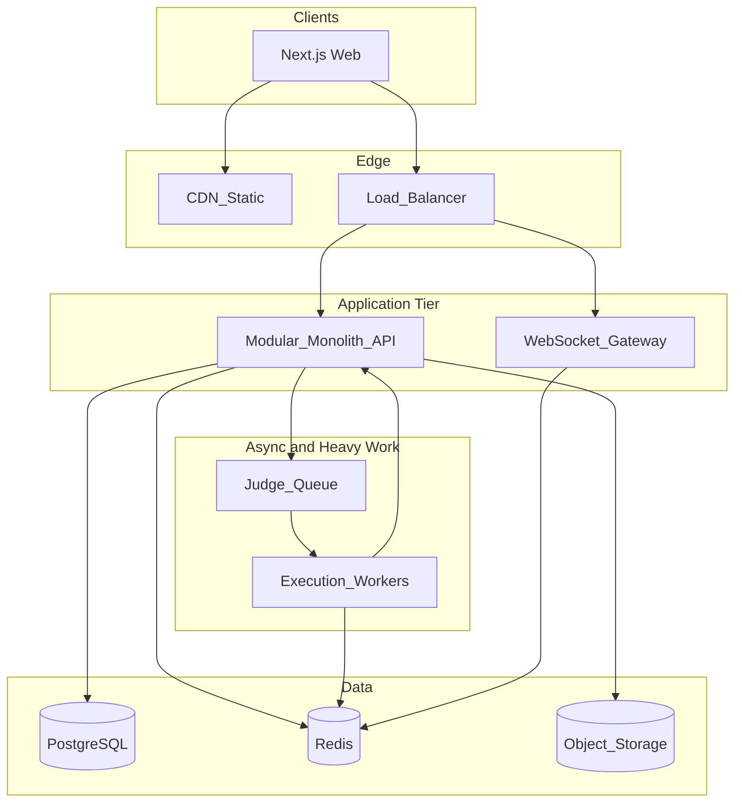

# AlgoArena — System Architecture & Roadmap

## 1. High-level system design (text + diagram)

**Recommended shape for launch:** **Modular monolith** with **well-defined bounded contexts** (Auth, Users/Profiles, Curriculum, Problems, Submissions, Execution, Matching, Matches, Ratings, Gamification, Social, Notifications). Expose a **single API gateway** (or BFF) and **one primary database** with clear schemas per module. **Extract services only when a boundary needs independent scaling** (execution workers, real-time gateway, matchmaking).

**Why not microservices on day one:** Two engineers, interview prep timeline, and coupling between submissions → ratings → leaderboards create heavy operational cost (distributed transactions, tracing, deploy coordination). A modular monolith keeps velocity high while the **code execution pool** and **WebSocket/match** layer are already natural "sidecars" (workers + stateful gateways).

**Core runtime components:**

- **Web app (Next.js):** SSR for marketing/SEO, client-heavy IDE and match UI.
- **API layer:** REST for CRUD and commands; optional GraphQL later for complex dashboards—not required for MVP.
- **Real-time service:** WebSocket server (dedicated process or horizontal pods) for match rooms, presence, countdowns, submission status; **Redis Pub/Sub** (or NATS) to fan out events across instances.
- **Code execution:** **Queue (e.g., Redis Streams / SQS) + worker pool** running **gVisor/Firecracker or hardened Docker** (no root, read-only FS, seccomp, cgroup CPU/mem/time, network egress denied). **Separate VPC/subnet** from app DB.
- **Data stores:** PostgreSQL (source of truth), Redis (cache, sessions, leaderboards, match state, rate limits), object storage (avatars, optional problem assets).
- **Observability:** OpenTelemetry traces, structured logs, metrics (latency p95/p99 for judge queue).

**Service boundaries (logical modules, deployable together initially):**

| Module       | Responsibility                                                                                      |
| ------------ | --------------------------------------------------------------------------------------------------- |
| Auth         | **Delegated to Auth0** (login, MFA, social IdPs); app validates JWTs and maps `sub` → internal user |
| User/Profile | Display name, prefs, language defaults, privacy                                                     |
| Curriculum   | Topics, lessons, ordering, prerequisites                                                            |
| Problem      | Statements, constraints, public/hidden tests metadata, tags                                         |
| Submission   | Code snapshots, status, judge results                                                               |
| Execution    | Sandbox contract, resource limits, multi-language images                                            |
| Matchmaking  | Queues by rating/mode, accept/decline friend challenges                                             |
| Match        | Room state machine, problem pick, timers, winner resolution                                         |
| Rating       | ELO/Glicko-2 updates, history, season resets                                                        |
| Gamification | XP, levels, streaks, achievements rules                                                             |
| Social       | Friends, blocks, follows (optional)                                                                 |
| Discussion   | Threads per problem, moderation hooks                                                               |
| Leaderboard  | Denormalized ranks, periodic recompute or Redis sorted sets                                         |

---

## 2. Database schema design (PostgreSQL)

**Principles:** Strong consistency for money-like concepts (ratings, match outcomes); eventual consistency OK for leaderboards and analytics aggregates.

**Core tables (representative):**

- **users** — `id` (internal UUID), `**auth0_sub` (unique, from Auth0 `sub` claim), `email` (optional cache from token), `created_at`, `status`
- **user_profiles** — `user_id`, `display_name`, `avatar_url`, `bio`, `timezone`
- **user_auth_providers** — optional if you only use Auth0; otherwise `user_id`, `provider`, `provider_subject` (Auth0 fills `auth0` + `sub`)
- **topics** — `id`, `slug`, `title`, `order_index`, `parent_topic_id`
- **lessons** — `id`, `topic_id`, `title`, `content_md`, `order_index`
- **problems** — `id`, `slug`, `title`, `difficulty` (enum), `statement_md`, `time_limit_ms`, `memory_limit_mb`, `is_published`
- **problem_topics** — `problem_id`, `topic_id` (M:N)
- **problem_tags** — tags for patterns (e.g. `sliding_window`)
- **test_cases** — `id`, `problem_id`, `is_public`, `input_blob_ref`, `output_blob_ref`, `order_index` (store large I/O in object storage or bytea with size caps)
- **submissions** — `id`, `user_id`, `problem_id`, `language`, `code_hash` or `code_ref`, `status`, `runtime_ms`, `memory_kb`, `passed_cases`, `total_cases`, `created_at`
- **submission_test_results** — optional per-case detail for debugging (public only or post-match)
- **matches** — `id`, `mode` (ranked/casual/friend), `status`, `started_at`, `ended_at`, `problem_id`, `winner_user_id`, `rating_delta` JSON
- **match_participants** — `match_id`, `user_id`, `rating_at_match`, `submission_id`, `score`, `ready_at`
- **matchmaking_queue** — ephemeral; often **Redis** instead of PG for TTL and pop semantics; if persisted: `user_id`, `mode`, `rating`, `enqueued_at`
- **ratings** — `user_id`, `mode`, `rating_value`, `games_played`, `volatility` (if Glicko-2), `updated_at`
- **rating_history** — append-only for charts and audits
- **friendships** — `user_id`, `friend_user_id`, `status` (pending/accepted/blocked)
- **xp_ledger** — `user_id`, `delta`, `reason`, `ref_type`, `ref_id`, `created_at` (append-only)
- **user_streaks** — `user_id`, `current_streak`, `longest_streak`, `last_activity_date` (UTC date bucket)
- **achievements** / **user_achievements** — definition table + unlock rows
- **discussion_threads** / **discussion_posts** — `problem_id`, `user_id`, `body`, `parent_post_id`
- **notifications** — outbox pattern optional for reliable push/email later

**Indexes:** `(user_id, created_at DESC)` on submissions; `(problem_id, difficulty)` for admin; `(match_id)` on participants; GIN on `problem_tags` if using arrays/tsvector for search.

**Redis (not a replacement for PG truth):** match room TTL keys, rate limits, session cache, **sorted sets** for global/friends leaderboards (member = user_id, score = rating or XP), matchmaking queues.

---

## 3. API endpoint structure (REST-first)

**Conventions:** `/v1/...`, JSON, `**Authorization: Bearer <Auth0 access_token>` on protected routes. Idempotent POSTs where needed (`Idempotency-Key` for payments later; optional for match create).

**Auth (Auth0 — not implemented by hand):** Sign-up, login, password reset, MFA, and social connections live on **Auth0 Universal Login**. The API does **not** expose register/login/password endpoints. Use **Auth0 Next.js SDK** (or SPA SDK) on the client for session/login; the API **validates JWTs** (JWKS, `issuer`, `audience`) and **upserts** an internal user row on first authenticated request. Optional: `GET /v1/users/me` or `GET /v1/auth/me` returns the merged profile (Auth0 identity + app data). Logout is client-side + Auth0 logout URL as needed.

**Users/Profiles:** `GET/PATCH /v1/users/me`, `GET /v1/users/:id` (public fields)

**Curriculum:** `GET /v1/topics`, `GET /v1/topics/:slug`, `GET /v1/topics/:slug/lessons`, `GET /v1/lessons/:id`

**Problems:** `GET /v1/problems` (filters: topic, tag, difficulty), `GET /v1/problems/:slug`, `GET /v1/problems/:slug/tests/public` (sample only)

**Submissions (practice):** `POST /v1/problems/:slug/submissions` (returns `submission_id`), `GET /v1/submissions/:id`, `GET /v1/users/me/submissions`

**Matches:** `POST /v1/matches/queue` (join ranked), `DELETE /v1/matches/queue`, `POST /v1/matches/challenges` (friend), `POST /v1/matches/:id/accept`, `GET /v1/matches/:id`, `GET /v1/users/me/matches`

**WebSocket:** `wss://.../v1/ws?token=...` — subscribe to `match:{id}` channel; events: `room_state`, `opponent_submitted`, `timer_tick`, `match_end`

**Ratings:** `GET /v1/users/me/rating`, `GET /v1/leaderboards/:scope` (`global`, `friends` if implemented)

**Gamification:** `GET /v1/users/me/progress` (XP, level, streak), `GET /v1/achievements`, `POST /v1/activity/heartbeat` (optional, for streak—prefer deriving from real actions)

**Social:** `POST /v1/friends/requests`, `POST /v1/friends/requests/:id/accept`, `GET /v1/friends`

**Discussions:** `GET /v1/problems/:slug/discussions`, `POST /v1/problems/:slug/discussions`, nested replies

**Admin (internal):** problem CRUD, test upload, moderation—protect with role flags.

**GraphQL (optional phase 2):** Single endpoint for profile dashboard aggregating many small REST calls; not MVP-critical.

---

## 4. Tech stack recommendations (with justification)

| Layer         | Choice                                                                                       | Why                                                                                                                               |
| ------------- | -------------------------------------------------------------------------------------------- | --------------------------------------------------------------------------------------------------------------------------------- |
| Frontend      | **Next.js (App Router) + TypeScript + Tailwind**                                             | SSR/SEO for growth, strong hiring signal, one codebase for marketing + app                                                        |
| Editor        | **Monaco Editor**                                                                            | VS Code-like UX, language support                                                                                                 |
| API           | **TypeScript on Node (Fastify or NestJS)** or **Go (chi/fiber)**                             | TS: fastest full-stack overlap for 2 JS-friendly interns; Go: simpler concurrency + small binaries for WS + workers if you prefer |
| DB            | **PostgreSQL**                                                                               | Relational fit, JSON columns if needed, mature tooling                                                                            |
| Cache/RT      | **Redis**                                                                                    | Sessions, queues, match state, leaderboards                                                                                       |
| Queue         | **Redis Streams** (MVP) → **SQS/RabbitMQ** at scale                                          | Start simple; migrate when durability SLAs demand                                                                                 |
| Execution     | **Docker + gVisor** (GCP) or **Firecracker** (AWS) / isolate with **nsjail**-style hardening | Defense in depth; never `exec` user code in API process                                                                           |
| Real-time     | **Socket.io** or **uWebSockets** (Node) / **gorilla/websocket** (Go)                         | Match sync; align with API language                                                                                               |
| Auth          | **Clerk / Auth0** (speed) or **self-hosted OIDC** (cost control)                             | Ship fast; migrate if needed                                                                                                      |
| Infra         | **Fly.io / Railway / Render** (MVP) → **AWS/GCP** + **Terraform**                            | Validate product before heavy cloud spend                                                                                         |
| CI/CD         | **GitHub Actions**                                                                           | Lint, test, typecheck, build images, deploy                                                                                       |
| Observability | **OpenTelemetry + Grafana Cloud or Datadog**                                                 | Debug judge latency and WS issues early                                                                                           |

**Concurrency for matches:** Authoritative **match state on server**; clients are dumb. Use **atomic Redis updates** or **single-threaded room actor** per match ID to avoid races. **PostgreSQL** persists final outcomes; Redis holds ephemeral countdown and presence.

### Auth0 integration (concrete)

- **Tenant:** One Auth0 application for the Next.js app (Regular Web App or SPA + API depending on your BFF pattern); register an **Auth0 API** (identifier = audience) for the backend.
- **Tokens:** Prefer **access tokens** (JWT) for calling your REST API; validate signature via **JWKS**, check `exp`, `iss`, `aud`, and optionally custom claims (e.g. internal role via **Auth0 Actions**).
- **User mapping:** On first valid request, `INSERT ... ON CONFLICT (auth0_sub)` into **users**; all foreign keys use internal `user_id`.
- **WebSockets:** Either pass a **short-lived** access token on connect and validate server-side, or use a **session cookie** issued by your BFF that the WS gateway trusts—pick one pattern and document it.
- **Secrets:** `AUTH0_DOMAIN`, `AUTH0_AUDIENCE`, client id/secret only where the SDK requires them; no long-lived user passwords in your codebase.
- **Admin roles:** Model via Auth0 **Roles + Permissions** in the token or a local `users.role` updated from an Action / Management API sync.

---

## 5. Code execution system (security + multi-language)

- **Never** run user code in the API process.
- **Per-submission container** or **microVM** with: no network (or allowlist only to internal stub), **non-root user**, **read-only root FS**, **tmpfs** for `/tmp` with size cap, **CPU/memory/time wall** enforced by cgroup + kill, **max processes**, **no ptrace**, **seccomp** default profile.
- **Separate images** per language/runtime (Python 3.11, OpenJDK 17, .NET, GCC, Go) pinned by digest.
- **Compile** (if needed) in sandbox; **run** with same limits; capture stdout/stderr with byte limits.
- **Compare** outputs with normalized whitespace rules defined per problem (or exact byte match for strict problems).
- **Queue depth + per-user rate limits** to prevent DoS.
- **Secrets:** tests and hidden inputs only on workers from secure store; API returns only job id + final verdict summary.

---

## 6. Frontend UX (problem solving, live comp, dashboard)

- **Problem page:** Left statement + constraints; center Monaco; bottom/run panel with public samples; subtle XP/streak widget.
- **Live match:** Full-screen focus mode; synchronized phase UI (prep → code → submit); opponent status as anonymized progress (no code peek); clear timer; anti-AFK rules later.
- **Dashboard:** Streak calendar, rating chart, weak topics from failed tags, next recommended lesson (adaptive v1 = rule-based: most missed tag).

---

## 7. Scalability and performance

- **Horizontal scale:** Stateless API behind LB; **sticky sessions** or **Redis-backed** socket adapter for WebSockets.
- **Caching:** Problem statements CDN-cached; **user profile** and **leaderboard top-N** in Redis with TTL.
- **Matchmaking:** Start **bucketed queues** (e.g. 100-point rating buckets, widen after wait time); avoid O(n) global scans.
- **Submissions:** Worker autoscaling on queue depth (KEDA on Kubernetes or cloud scaler).

---

## 8. DevOps and deployment

- **Dockerfile** per app + per judge image; **docker-compose** for local dev.
- **GitHub Actions:** `on push` → test → build → push image → deploy staging; tagged releases → prod.
- **Secrets** in cloud secret manager; **DB migrations** (Flyway, Prisma migrate, or Atlas).
- **Monitoring:** SLOs on judge p95, WS disconnect rate, match abandon rate.

---

## 9. DSA curriculum, difficulty, and interview patterns

**Progression order (curated):**

1. Complexity, Big-O, arrays/strings
2. Hash maps / sets
3. Two pointers, sliding window
4. Stacks, queues, monotonic stack
5. Linked lists
6. Binary search (on array + answer space)
7. Sorting, custom comparators, merge patterns
8. Recursion & backtracking
9. Trees (BST, traversals), heaps / priority queue
10. Graphs: BFS/DFS, topo sort, union-find
11. Shortest path (Dijkstra basics), MST intro
12. Greedy
13. DP (1D → 2D → knapsack, LCS, grid)
14. Bit manipulation
15. Tries, advanced graphs (optional track)

**Difficulty tiers:** **Easy** (straight pattern, ≤25 min), **Medium** (1–2 concepts, 25–45 min), **Hard** (non-obvious reduction, 45+ min). Tag every problem with **1–3 primary patterns** (e.g. `sliding_window`, `dfs`, `dp`).

**Adaptive learning (MVP-simple):** After each failed submission or match loss, bump related topic in "review queue"; after wins, unlock adjacent topic nodes on the graph.

---

## 10. Game design (retention, balance, fairness, integrity)

- **Daily return:** Streak (one meaningful action counts: 1 solved problem or 1 match), **daily quest** (easy win), **weekly cup** with cosmetic badge—not pay-to-win.
- **Learning vs competition:** **Separate ladders** or **modes**: "Practice path" XP vs "Ranked" rating; allow unrated matches for trying new topics.
- **Fair matchmaking:** Widen rating range over wait time; seed new users with **provisional** rating (high volatility Glicko-2 or provisional ELO).
- **Cheating/plagiarism:** No copy-paste from web in ranked (optional—hurts UX); ** Moss-style** similarity on submissions (post-MVP); **tab focus / paste events** as soft signals only; **same problem + short solve time** flagging; **obfuscation** of full statements in queue until match starts to reduce pre-staging; **replay** of keystroke timing controversial—defer.

---

## 11. MVP roadmap (step-by-step)

1. **Auth + profiles + empty shell UI** (Next.js, design system).
2. **Problem CRUD (admin) + public problem list + problem detail + Monaco.**
3. **Judge MVP:** one language (Python), public + hidden tests, quotas.
4. **Submissions + verdicts + submission history.**
5. **Topics/lessons static or CMS-driven; link problems to topics.**
6. **XP + streak (server-derived from submissions).**
7. **Friend list + challenge invite (async accept).**
8. **Real-time 1v1:** same problem, timer, first correct or highest tests passed wins—**simple rule set**.
9. **ELO or Glicko-2** on ranked; history page.
10. **Global leaderboard (Redis ZSET)** + basic profile stats.
11. **Discussions v1** (moderation manual).
12. Harden judge (second language, stricter sandbox), CI/CD, staging/prod.

**Defer past MVP:** weekly tournaments, teams, full adaptive ML, advanced anti-cheat, mobile apps.

---

## 12. Future scalability roadmap

- Extract **Execution Service** + autoscaling workers; **API stays thin**.
- Split **WebSocket gateway** with Redis adapter and regional edge.
- Move matchmaking to dedicated service with **strong ordering** guarantees.
- **Read replicas** for analytics dashboards; **CQRS** for leaderboards if write hot.
- **Event bus** (Kafka/NATS) for `submission.graded`, `match.completed` → analytics, notifications, achievements.
- **Kubernetes** when multi-service ops payoff exceeds cost.
- **CDN + edge caching** for static curriculum globally.

---

## 13. Key challenges and risks

| Risk                   | Mitigation                                                                                  |
| ---------------------- | ------------------------------------------------------------------------------------------- |
| Sandbox escape         | gVisor/Firecracker, minimal images, no CAP_SYS_ADMIN, regular base image updates            |
| Judge DoS              | Queues, per-user limits, global concurrency caps                                            |
| WS complexity at scale | Sticky sessions, Redis pub/sub, load tests early                                            |
| Rating manipulation    | Smurf detection heuristics, report flow, cooldown on new accounts in ranked                 |
| Cheating               | Phased: stats flags, similarity detection, manual review; accept some leakage in casual     |
| Content cost           | Start with **CC-licensed / original** small set; grow with community contributions + review |

---

## 14. Unique positioning vs LeetCode / Duolingo / Codeforces

- **Short-session ranked duels** tied to **same interview patterns** you're weak on (post-match "one drill" suggestion).
- **Streak and quests** anchored to **real solves**, not passive video.
- **Friend ladder** and **weekly bragging-rights** cup optimized for **two-person study groups** (your stated use case).
- **Transparent post-match breakdown:** time to first test pass, wrong submissions, pattern tags—actionable, not just AC/WA.
- **Honest hybrid positioning:** not replacing Codeforces depth; winning on **habit + head-to-head + curriculum glue**.

---

## Suggested immediate next step (post-approval)

Initialize the repo with **Next.js + Fastify/Nest (or Go) + PostgreSQL + Redis + docker-compose**, implement **auth + one problem + Python judge + one submission** end-to-end before touching matchmaking—this validates the riskiest component (execution) early.
