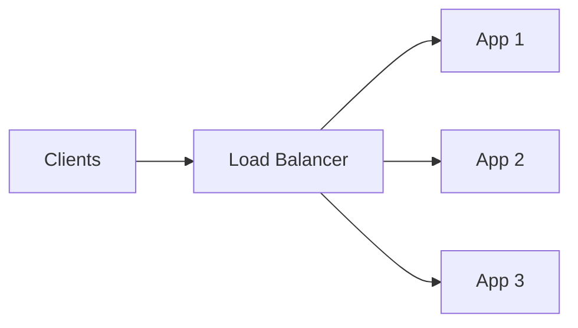

## Goal

Understand L4 vs L7 load balancing, common algorithms, health checks, and how to discuss load balancing in a systems design interview.

## Core concepts

- A load balancer distributes traffic across multiple backends to improve availability and throughput.
- **L4** (TCP/UDP) vs **L7** (HTTP) load balancing:
  - L4 is fast and protocol-agnostic; limited request awareness.
  - L7 can route by path/host/header and do retries, but adds overhead.
- Common algorithms: round-robin, least-connections, weighted, consistent hashing.
- Health checks + outlier detection keep traffic away from unhealthy instances.

## Trade-offs

- **Simplicity vs control**: L4 is simpler; L7 enables richer routing and policies.
- **Sticky sessions** simplify stateful apps but hurt balancing and failover; prefer stateless + shared state.
- **Connection draining** improves UX during deploys but slows scaling down.

## Failure modes

- **Single point of failure**: run multiple LBs (active-active) and use health-checked DNS/anycast.
- **Bad health checks**: shallow checks route to broken instances; use deep checks with timeouts.
- **Over-aggressive retries**: amplify load during partial outages; cap retries and use backoff.
- **Hotspot routing**: poor hashing/weights overload a subset of backends.

## Interview prompts

1. Where do you terminate TLS and why (edge vs service mesh vs app)?
2. Do you need sticky sessions? If yes, what’s the failure story?
3. How do you do gradual rollouts safely (draining, weights, canaries)?

## Mini design drill (10-15 min)

Design load balancing for a stateless API:

- Choose L4 vs L7 and justify.
- Pick an algorithm (and when you’d switch).
- Define health check endpoint behavior and thresholds.
- Describe deploy behavior (connection draining).

## Checkpoint quiz

1. What’s one advantage of L7 load balancing over L4?
2. Why can sticky sessions be risky?
3. What’s a common pitfall with retries at the load balancer?
