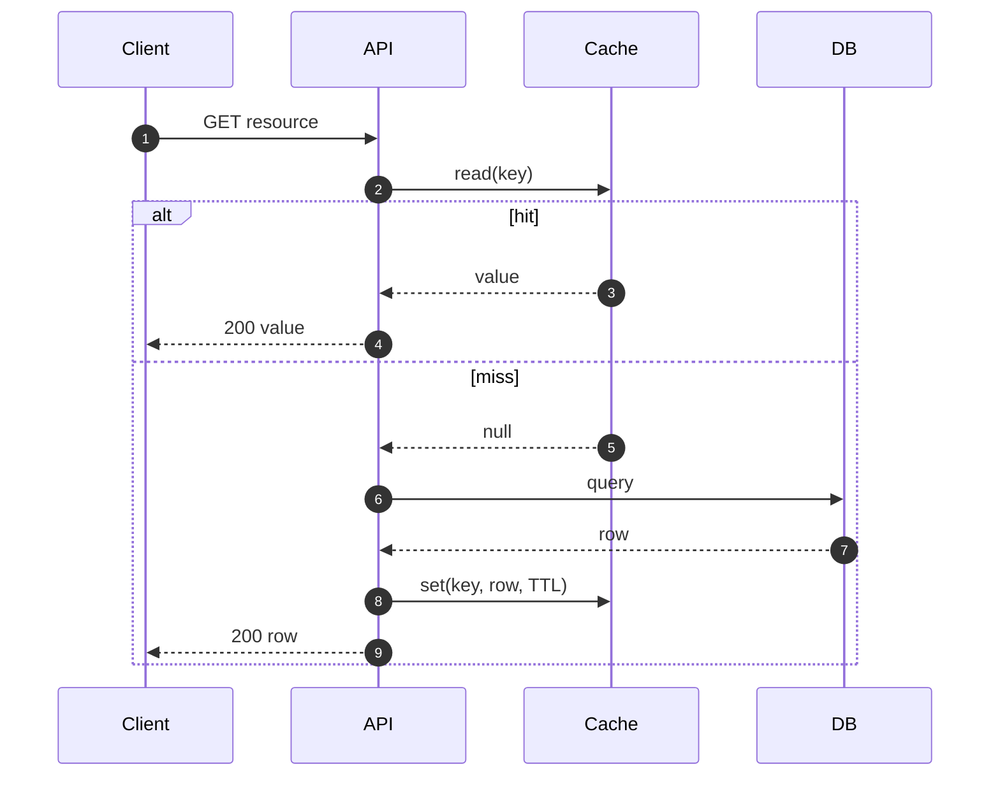

## Goal

Learn cache-aside, write-through, write-behind patterns, TTL strategies, and invalidation approaches for systems design interviews.

## Core concepts

- Caches reduce latency and backend load by serving repeated reads from faster storage.
- Common patterns:
  - **Cache-aside**: app reads cache, falls back to DB on miss, then populates cache.
  - **Write-through**: writes go to cache and backing store together.
  - **Write-behind**: cache acknowledges write, flushes to store asynchronously.
- TTLs handle staleness but don’t solve correctness for all invariants.
- Invalidation approaches:
  - Explicit invalidation on write (delete or update cache keys)
  - Versioned keys (include a version/hash in the cache key)
  - Event-driven invalidation (publish change events to consumers)

## Trade-offs

- **Freshness vs performance**: aggressive caching improves latency but risks stale reads.
- **Granularity**: coarse keys are simpler but invalidate more; fine keys are harder but reduce churn.
- **Cache stampede**: many concurrent misses overload the DB; mitigate with request coalescing/locks and jittered TTLs.

## Failure modes

- **Stale data**: missing invalidation paths; mitigate with explicit invalidation + TTL.
- **Thundering herd**: synchronized expirations; add TTL jitter and “soft TTL” refresh.
- **Hot key**: one key dominates traffic; shard the key or add local in-process caching.
- **Cache penetration**: repeated misses for nonexistent keys; use negative caching with short TTL.

## Interview prompts

1. Where would you cache in a URL shortener (resolve path) and what’s the key?
2. How would you cache chat history while keeping “new message” correctness?
3. How do you prevent a cache stampede after a deploy or outage?

## Mini design drill (10-15 min)

Design caching for “resolve short URL”:

- Define cache key(s) and stored value.
- Decide TTL policy and invalidation trigger.
- Handle nonexistent keys (negative cache).
- Add one stampede mitigation.

## Checkpoint quiz

1. What’s the difference between cache-aside and write-through?
2. Name one cause of cache stampede and one mitigation.
3. When is negative caching useful?
