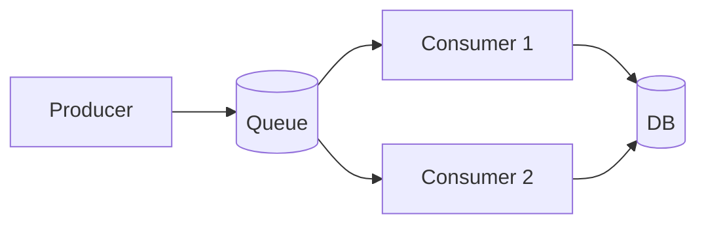

## Goal

Understand message queues, event-driven architectures, at-least-once vs exactly-once delivery, and back-pressure handling.

## Core concepts

- Queues decouple producers from consumers to smooth traffic and isolate failures.
- Delivery semantics:
  - **At-most-once**: no retries; may drop messages.
  - **At-least-once**: retries; must make handlers idempotent.
  - **Exactly-once**: usually “effectively once” via idempotency + dedupe.
- Ordering: global ordering is expensive; prefer per-key ordering where needed.
- Back-pressure: when consumers can’t keep up, apply shedding, buffering, or scaling.

## Trade-offs

- **Latency vs reliability**: async improves throughput but adds delay and complexity.
- **Batching** increases efficiency but can increase tail latency.
- **Retries** improve success rate but can amplify load during incidents.

## Failure modes

- **Poison messages**: a message always fails; use DLQ and alerting.
- **Duplicate processing**: at-least-once delivery; require idempotency keys / dedupe.
- **Unbounded backlog**: sustained producer > consumer; scale consumers and set limits.
- **Retry storms**: coordinated retries; use exponential backoff + jitter and circuit breakers.

## Interview prompts

1. Design a notification pipeline for “send push/email/SMS” with retries and DLQ.
2. How do you guarantee a message isn’t processed twice?
3. When do you choose a queue vs a stream (log) abstraction?

## Mini design drill (10-15 min)

Design an async “send notification” flow:

- Define the message schema (fields).
- Define the consumer’s idempotency strategy.
- Define retry policy and DLQ trigger.
- Define 2 metrics you would alert on (backlog, age, error rate).

## Checkpoint quiz

1. Why do queue consumers often need idempotency?
2. What’s a DLQ and when do you use it?
3. What causes a retry storm and how do you mitigate it?
