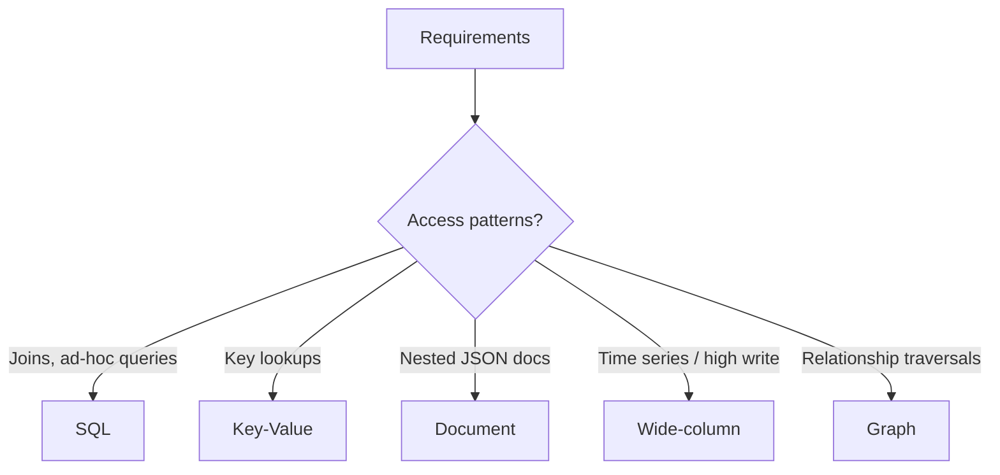

## Goal

Compare relational and non-relational databases, understand when to choose each, and articulate the decision clearly in an interview.

## Core concepts

- **SQL (relational)**: schemas, joins, strong consistency, powerful querying (OLTP).
- **NoSQL families**:
  - **Key-value**: simple lookups, great for caching/sessions.
  - **Document**: flexible schema per document, nested data, queryable fields.
  - **Wide-column**: high write throughput, partition-key based access.
  - **Graph**: relationship-centric queries (traversals).
- Choose based on access patterns, consistency needs, and operational constraints.

## Trade-offs

- **Schema rigidity vs flexibility**: SQL migrations vs evolving document shapes.
- **Join support**: SQL excels; many NoSQL systems push joins to the app layer.
- **Transactions**: SQL strong; NoSQL varies by product and may require redesign.
- **Operational complexity**: some NoSQL systems require careful partitioning to avoid hotspots.

## Failure modes

- **Wrong primary key**: causes hotspots and poor scaling; leads to expensive rewrites.
- **Query drift**: new features need queries the DB can’t support efficiently.
- **Inconsistent data shapes** (document DB): multiple versions of “same” object.
- **Over-indexing**: write amplification and storage blowups.

## Interview prompts

1. For a URL shortener mapping, what DB type would you choose and why?
2. For chat messages, what partition key prevents hotspots?
3. When would you add a search engine (e.g., for full-text) instead of DB queries?

## Mini design drill (10-15 min)

Pick: URL shortener or chat.

- List the top 3 queries.
- Choose SQL vs a NoSQL family and justify in one paragraph.
- Define primary key / partition key.
- Define one index you’d add and one you’d avoid.

## Checkpoint quiz

1. What is an access pattern and why does it drive DB choice?
2. Name one common hotspot cause in distributed databases.
3. When are joins a strong reason to choose SQL?
