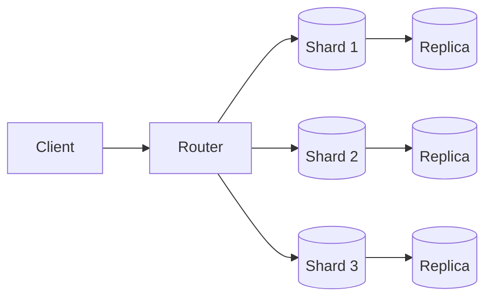

## Goal

Learn horizontal partitioning (sharding), replication strategies (leader-follower, multi-leader, leaderless), and how to discuss data distribution in interviews.

## Core concepts

- **Partitioning (sharding)** splits data across nodes to scale reads/writes/storage.
- Common partitioning strategies:
  - **Range**: good for ordered queries; risks hotspots on “latest” ranges.
  - **Hash**: balances load; makes range scans harder.
  - **Directory/lookup**: flexible placement; adds routing dependency.
- **Replication** improves availability and read throughput:
  - **Leader-follower**: simple writes, read replicas; follower lag.
  - **Multi-leader**: writes in multiple regions; conflict resolution required.
  - **Leaderless**: quorum reads/writes; more complex tuning.

## Trade-offs

- **Rebalancing cost**: moving shards is operationally heavy; plan for resharding.
- **Consistency vs availability**: replication choices affect write behavior during partitions.
- **Cross-shard queries**: joins/aggregations become expensive; may require denormalization.

## Failure modes

- **Hot partitions**: skewed keys (e.g., celebrity user); mitigate with better keys and load-aware routing.
- **Replica lag**: stale reads; use read-your-writes where required or route to leader.
- **Split brain** (multi-leader): conflicting writes; require conflict resolution strategy.
- **Resharding bugs**: partial moves or routing mistakes cause data loss/duplication.

## Interview prompts

1. How would you shard chat messages to support “latest messages” efficiently?
2. How do you handle read-your-writes in a leader-follower setup?
3. What’s your strategy if a single user becomes a hotspot?

## Mini design drill (10-15 min)

Design sharding for “chat messages”:

- Pick partition key(s) and explain why.
- Describe how you fetch the latest \(N\) messages.
- Describe how you scale reads with replicas.
- Describe one operational task (rebalancing/resharding) you expect to do.

## Checkpoint quiz

1. Why does hash partitioning make range queries harder?
2. What causes replica lag and why does it matter?
3. What’s one approach to mitigating hot partitions?
