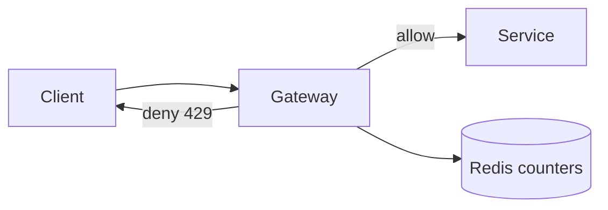

## Goal

Understand token bucket, sliding window, and fixed window algorithms, and how to apply rate limiting at the API gateway level.

## Core concepts

- Rate limiting protects services from abuse and smooths load (DoS, bots, spikes).
- Common algorithms:
  - **Token bucket**: allows bursts up to bucket size; steady refill rate.
  - **Leaky bucket**: smooths output rate; bursts queue up (or drop).
  - **Fixed window**: simple but has boundary bursts.
  - **Sliding window**: more accurate; slightly more state/cost.
- Placement:
  - Edge/API gateway for global protection
  - Per-service/per-endpoint for local constraints
  - Per-user/per-IP/per-token for fairness

## Trade-offs

- **Fairness vs simplicity**: per-IP is simple but breaks behind NAT; per-user needs auth.
- **Stateful vs stateless**: distributed limiters often need shared state (Redis) or consistent hashing.
- **Burst allowance**: improves UX but can stress downstream systems.

## Failure modes

- **Limiter outage becomes outage**: make limiter fail-open for non-critical paths or degrade gracefully.
- **Key choice errors**: per-IP blocks shared networks; per-user can be bypassed with new accounts.
- **Clock skew** (windowed methods): inconsistent limits; prefer server-side time.
- **Inconsistent enforcement** across instances: without shared state, users bypass by hitting different nodes.

## Interview prompts

1. Where do you rate limit “create short link” vs “resolve short link” and why?
2. How do you enforce a global limit across many API instances?
3. How do you treat authenticated vs anonymous users?

## Mini design drill (10-15 min)

Design rate limiting for a public API:

- Define limits for anonymous and authenticated callers.
- Choose an algorithm for each (token bucket vs sliding window).
- Choose the key (userId, apiKey, IP) and justify.
- Describe what you return on deny (status + headers).

## Checkpoint quiz

1. Why is token bucket good for bursts?
2. What’s a common drawback of fixed window limiting?
3. Why do distributed limiters often use Redis (or similar)?
