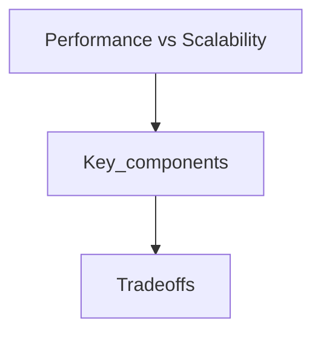

## Goal

Learn performance vs scalability using a vetted, open-licensed reference and apply it in interview-style design discussions.

## Core concepts

## Performance vs scalability

A service is **scalable** if it results in increased **performance** in a manner proportional to resources added. Generally, increasing performance means serving more units of work, but it can also be to handle larger units of work, such as when datasets grow.<a href=http://www.allthingsdistributed.com/2006/03/a_word_on_scalability.html>1</a>

Another way to look at performance vs scalability:

* If you have a **performance** problem, your system is slow for a single user.
* If you have a **scalability** problem, your system is fast for a single user but slow under heavy load.

### Source(s) and further reading

* [A word on scalability](http://www.allthingsdistributed.com/2006/03/a_word_on_scalability.html)
* [Scalability, availability, stability, patterns](http://www.slideshare.net/jboner/scalability-availability-stability-patterns/)

## Trade-offs

- Latency: Identify where you add hops (cache, LB, queues) and how it shifts p95/p99.
- Cost: Call out which components scale linearly vs super-linearly with traffic.
- Consistency: State which data must be strongly consistent vs can be eventual.
- Complexity: Note operational overhead (deployments, oncall, observability).

## Failure modes

- Single points of failure and missing failover paths.
- Retry storms, overload collapse, and cache stampedes.
- Hot partitions / uneven traffic distribution and its impact on SLOs.

## Interview prompts

1. What are the top 2 constraints that drive this design choice?
2. What breaks first at 10× traffic, and how do you know?
3. What would you simplify for v1 and why?

## Mini design drill (10-15 min)

- Pick a product you use daily and identify where this concept appears in its architecture.
- Write 3 concrete SLOs and name the metrics you would monitor.

## Checkpoint quiz

1. What problem does this concept solve?
2. What is the main trade-off it introduces?
3. Name one common failure mode and one mitigation.
4. Where would you apply it in a URL shortener or chat system?
5. What metric would tell you it is working?
