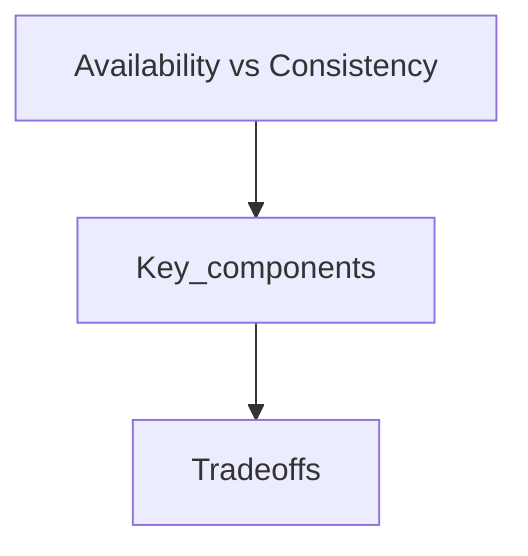

## Goal

Learn availability vs consistency using a vetted, open-licensed reference and apply it in interview-style design discussions.

## Core concepts

## Availability vs consistency

### CAP theorem

  
   
  <i><a href="https://robertgreiner.com/cap-theorem-revisited">Source: CAP theorem revisited</a></i>

In a distributed computer system, you can only support two of the following guarantees:

* **Consistency** - Every read receives the most recent write or an error
* **Availability** - Every request receives a response, without guarantee that it contains the most recent version of the information
* **Partition Tolerance** - The system continues to operate despite arbitrary partitioning due to network failures

*Networks aren't reliable, so you'll need to support partition tolerance.  You'll need to make a software tradeoff between consistency and availability.*

#### CP - consistency and partition tolerance

Waiting for a response from the partitioned node might result in a timeout error.  CP is a good choice if your business needs require atomic reads and writes.

#### AP - availability and partition tolerance

Responses return the most readily available version of the data available on any node, which might not be the latest.  Writes might take some time to propagate when the partition is resolved.

AP is a good choice if the business needs to allow for [eventual consistency](#eventual-consistency) or when the system needs to continue working despite external errors.

### Source(s) and further reading

* [CAP theorem revisited](https://robertgreiner.com/cap-theorem-revisited/)
* [A plain english introduction to CAP theorem](http://ksat.me/a-plain-english-introduction-to-cap-theorem)
* [CAP FAQ](https://github.com/henryr/cap-faq)
* [The CAP theorem](https://www.youtube.com/watch?v=k-Yaq8AHlFA)

## Trade-offs

- Latency: Identify where you add hops (cache, LB, queues) and how it shifts p95/p99.
- Cost: Call out which components scale linearly vs super-linearly with traffic.
- Consistency: State which data must be strongly consistent vs can be eventual.
- Complexity: Note operational overhead (deployments, oncall, observability).

## Failure modes

- Single points of failure and missing failover paths.
- Retry storms, overload collapse, and cache stampedes.
- Hot partitions / uneven traffic distribution and its impact on SLOs.

## Interview prompts

1. What are the top 2 constraints that drive this design choice?
2. What breaks first at 10× traffic, and how do you know?
3. What would you simplify for v1 and why?

## Mini design drill (10-15 min)

- Pick a product you use daily and identify where this concept appears in its architecture.
- Write 3 concrete SLOs and name the metrics you would monitor.

## Checkpoint quiz

1. What problem does this concept solve?
2. What is the main trade-off it introduces?
3. Name one common failure mode and one mitigation.
4. Where would you apply it in a URL shortener or chat system?
5. What metric would tell you it is working?
