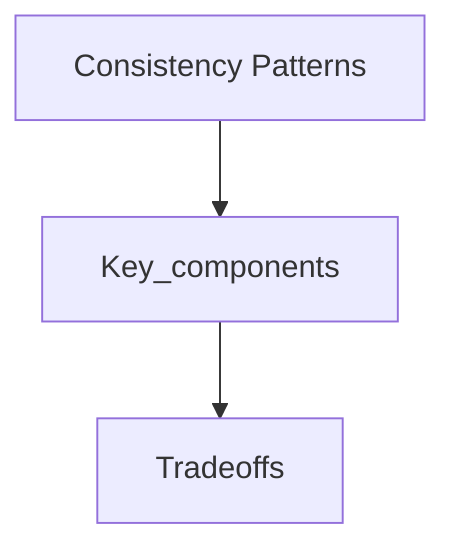

## Goal

Learn consistency patterns using a vetted, open-licensed reference and apply it in interview-style design discussions.

## Core concepts

## Consistency patterns

With multiple copies of the same data, we are faced with options on how to synchronize them so clients have a consistent view of the data.  Recall the definition of consistency from the [CAP theorem](#cap-theorem) - Every read receives the most recent write or an error.

### Weak consistency

After a write, reads may or may not see it.  A best effort approach is taken.

This approach is seen in systems such as memcached.  Weak consistency works well in real time use cases such as VoIP, video chat, and realtime multiplayer games.  For example, if you are on a phone call and lose reception for a few seconds, when you regain connection you do not hear what was spoken during connection loss.

### Eventual consistency

After a write, reads will eventually see it (typically within milliseconds).  Data is replicated asynchronously.

This approach is seen in systems such as DNS and email.  Eventual consistency works well in highly available systems.

### Strong consistency

After a write, reads will see it.  Data is replicated synchronously.

This approach is seen in file systems and RDBMSes.  Strong consistency works well in systems that need transactions.

### Source(s) and further reading

* [Transactions across data centers](http://snarfed.org/transactions_across_datacenters_io.html)

## Trade-offs

- Latency: Identify where you add hops (cache, LB, queues) and how it shifts p95/p99.
- Cost: Call out which components scale linearly vs super-linearly with traffic.
- Consistency: State which data must be strongly consistent vs can be eventual.
- Complexity: Note operational overhead (deployments, oncall, observability).

## Failure modes

- Single points of failure and missing failover paths.
- Retry storms, overload collapse, and cache stampedes.
- Hot partitions / uneven traffic distribution and its impact on SLOs.

## Interview prompts

1. What are the top 2 constraints that drive this design choice?
2. What breaks first at 10× traffic, and how do you know?
3. What would you simplify for v1 and why?

## Mini design drill (10-15 min)

- Pick a product you use daily and identify where this concept appears in its architecture.
- Write 3 concrete SLOs and name the metrics you would monitor.

## Checkpoint quiz

1. What problem does this concept solve?
2. What is the main trade-off it introduces?
3. Name one common failure mode and one mitigation.
4. Where would you apply it in a URL shortener or chat system?
5. What metric would tell you it is working?
