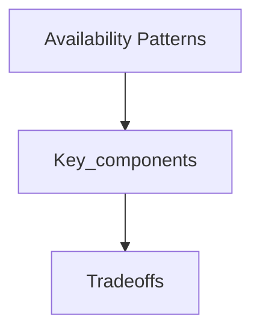

## Goal

Learn availability patterns using a vetted, open-licensed reference and apply it in interview-style design discussions.

## Core concepts



## Availability patterns

There are two complementary patterns to support high availability: **fail-over** and **replication**.

### Fail-over

#### Active-passive

With active-passive fail-over, heartbeats are sent between the active and the passive server on standby.  If the heartbeat is interrupted, the passive server takes over the active's IP address and resumes service.

The length of downtime is determined by whether the passive server is already running in 'hot' standby or whether it needs to start up from 'cold' standby.  Only the active server handles traffic.

Active-passive failover can also be referred to as master-slave failover.

#### Active-active

In active-active, both servers are managing traffic, spreading the load between them.

If the servers are public-facing, the DNS would need to know about the public IPs of both servers.  If the servers are internal-facing, application logic would need to know about both servers.

Active-active failover can also be referred to as master-master failover.

### Disadvantage(s): failover

* Fail-over adds more hardware and additional complexity.
* There is a potential for loss of data if the active system fails before any newly written data can be replicated to the passive.

### Replication

#### Master-slave and master-master

This topic is further discussed in the [Database](#database) section:

* [Master-slave replication](#master-slave-replication)
* [Master-master replication](#master-master-replication)

### Availability in numbers

Availability is often quantified by uptime (or downtime) as a percentage of time the service is available.  Availability is generally measured in number of 9s--a service with 99.99% availability is described as having four 9s.

#### 99.9% availability - three 9s

| Duration            | Acceptable downtime|
|---------------------|--------------------|
| Downtime per year   | 8h 45min 57s       |
| Downtime per month  | 43m 49.7s          |
| Downtime per week   | 10m 4.8s           |
| Downtime per day    | 1m 26.4s           |

#### 99.99% availability - four 9s

| Duration            | Acceptable downtime|
|---------------------|--------------------|
| Downtime per year   | 52min 35.7s        |
| Downtime per month  | 4m 23s             |
| Downtime per week   | 1m 5s              |
| Downtime per day    | 8.6s               |

#### Availability in parallel vs in sequence

If a service consists of multiple components prone to failure, the service's overall availability depends on whether the components are in sequence or in parallel.

###### In sequence

Overall availability decreases when two components with availability < 100% are in sequence:

```
Availability (Total) = Availability (Foo) * Availability (Bar)
```

If both `Foo` and `Bar` each had 99.9% availability, their total availability in sequence would be 99.8%.

###### In parallel

Overall availability increases when two components with availability < 100% are in parallel:

```
Availability (Total) = 1 - (1 - Availability (Foo)) * (1 - Availability (Bar))
```

If both `Foo` and `Bar` each had 99.9% availability, their total availability in parallel would be 99.9999%.


## Trade-offs

- Latency: Identify where you add hops (cache, LB, queues) and how it shifts p95/p99.
- Cost: Call out which components scale linearly vs super-linearly with traffic.
- Consistency: State which data must be strongly consistent vs can be eventual.
- Complexity: Note operational overhead (deployments, oncall, observability).

## Failure modes

- Single points of failure and missing failover paths.
- Retry storms, overload collapse, and cache stampedes.
- Hot partitions / uneven traffic distribution and its impact on SLOs.

## Interview prompts

1. What are the top 2 constraints that drive this design choice?
2. What breaks first at 10× traffic, and how do you know?
3. What would you simplify for v1 and why?

## Mini design drill (10-15 min)

- Pick a product you use daily and identify where this concept appears in its architecture.
- Write 3 concrete SLOs and name the metrics you would monitor.

## Checkpoint quiz

1. What problem does this concept solve?
2. What is the main trade-off it introduces?
3. Name one common failure mode and one mitigation.
4. Where would you apply it in a URL shortener or chat system?
5. What metric would tell you it is working?
