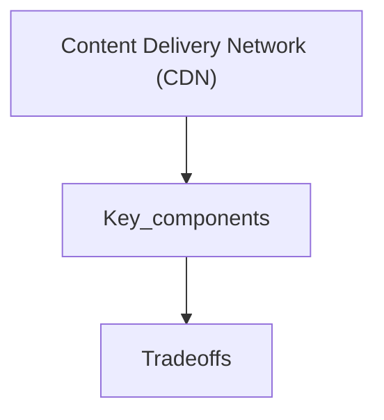

## Goal

Learn content delivery network (cdn) using a vetted, open-licensed reference and apply it in interview-style design discussions.

## Core concepts

## Content delivery network

  
   
  <i><a href=https://www.creative-artworks.eu/why-use-a-content-delivery-network-cdn/>Source: Why use a CDN</a></i>

A content delivery network (CDN) is a globally distributed network of proxy servers, serving content from locations closer to the user.  Generally, static files such as HTML/CSS/JS, photos, and videos are served from CDN, although some CDNs such as Amazon's CloudFront support dynamic content.  The site's DNS resolution will tell clients which server to contact.

Serving content from CDNs can significantly improve performance in two ways:

* Users receive content from data centers close to them
* Your servers do not have to serve requests that the CDN fulfills

### Push CDNs

Push CDNs receive new content whenever changes occur on your server.  You take full responsibility for providing content, uploading directly to the CDN and rewriting URLs to point to the CDN.  You can configure when content expires and when it is updated.  Content is uploaded only when it is new or changed, minimizing traffic, but maximizing storage.

Sites with a small amount of traffic or sites with content that isn't often updated work well with push CDNs.  Content is placed on the CDNs once, instead of being re-pulled at regular intervals.

### Pull CDNs

Pull CDNs grab new content from your server when the first user requests the content.  You leave the content on your server and rewrite URLs to point to the CDN.  This results in a slower request until the content is cached on the CDN.

A [time-to-live (TTL)](https://en.wikipedia.org/wiki/Time_to_live) determines how long content is cached.  Pull CDNs minimize storage space on the CDN, but can create redundant traffic if files expire and are pulled before they have actually changed.

Sites with heavy traffic work well with pull CDNs, as traffic is spread out more evenly with only recently-requested content remaining on the CDN.

### Disadvantage(s): CDN

* CDN costs could be significant depending on traffic, although this should be weighed with additional costs you would incur not using a CDN.
* Content might be stale if it is updated before the TTL expires it.
* CDNs require changing URLs for static content to point to the CDN.

### Source(s) and further reading

* [Globally distributed content delivery](https://figshare.com/articles/Globally_distributed_content_delivery/6605972)
* [The differences between push and pull CDNs](https://www.geeksforgeeks.org/system-design/pull-cdn-vs-push-cdn/)
* [Wikipedia](https://en.wikipedia.org/wiki/Content_delivery_network)

## Trade-offs

- Latency: Identify where you add hops (cache, LB, queues) and how it shifts p95/p99.
- Cost: Call out which components scale linearly vs super-linearly with traffic.
- Consistency: State which data must be strongly consistent vs can be eventual.
- Complexity: Note operational overhead (deployments, oncall, observability).

## Failure modes

- Single points of failure and missing failover paths.
- Retry storms, overload collapse, and cache stampedes.
- Hot partitions / uneven traffic distribution and its impact on SLOs.

## Interview prompts

1. What are the top 2 constraints that drive this design choice?
2. What breaks first at 10× traffic, and how do you know?
3. What would you simplify for v1 and why?

## Mini design drill (10-15 min)

- Pick a product you use daily and identify where this concept appears in its architecture.
- Write 3 concrete SLOs and name the metrics you would monitor.

## Checkpoint quiz

1. What problem does this concept solve?
2. What is the main trade-off it introduces?
3. Name one common failure mode and one mitigation.
4. Where would you apply it in a URL shortener or chat system?
5. What metric would tell you it is working?
