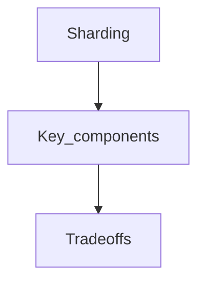

## Goal

Learn sharding using a vetted, open-licensed reference and apply it in interview-style design discussions.

## Core concepts

* [Reverse proxy (web server)](#reverse-proxy-web-server)
    * [Load balancer vs reverse proxy](#load-balancer-vs-reverse-proxy)
* [Application layer](#application-layer)
    * [Microservices](#microservices)
    * [Service discovery](#service-discovery)
* [Database](#database)
    * [Relational database management system (RDBMS)](#relational-database-management-system-rdbms)
        * [Master-slave replication](#master-slave-replication)
        * [Master-master replication](#master-master-replication)
        * [Federation](#federation)
        * [Sharding](#sharding)
        * [Denormalization](#denormalization)
        * [SQL tuning](#sql-tuning)
    * [NoSQL](#nosql)
        * [Key-value store](#key-value-store)
        * [Document store](#document-store)
        * [Wide column store](#wide-column-store)
        * [Graph Database](#graph-database)
    * [SQL or NoSQL](#sql-or-nosql)
* [Cache](#cache)
    * [Client caching](#client-caching)
    * [CDN caching](#cdn-caching)
    * [Web server caching](#web-server-caching)
    * [Database caching](#database-caching)
    * [Application caching](#application-caching)
    * [Caching at the database query level](#caching-at-the-database-query-level)
    * [Caching at the object level](#caching-at-the-object-level)
    * [When to update the cache](#when-to-update-the-cache)
        * [Cache-aside](#cache-aside)
        * [Write-through](#write-through)
        * [Write-behind (write-back)](#write-behind-write-back)
        * [Refresh-ahead](#refresh-ahead)
* [Asynchronism](#asynchronism)
    * [Message queues](#message-queues)
    * [Task queues](#task-queues)
    * [Back pressure](#back-pressure)
* [Communication](#communication)
    * [Transmission control protocol (TCP)](#transmission-control-protocol-tcp)
    * [User datagram protocol (UDP)](#user-datagram-protocol-udp)
    * [Remote procedure call (RPC)](#remote-procedure-call-rpc)
    * [Representational state transfer (REST)](#representational-state-transfer-rest)
* [Security](#security)
* [Appendix](#appendix)
    * [Powers of two table](#powers-of-two-table)
    * [Latency numbers every programmer should know](#latency-numbers-every-programmer-should-know)
    * [Additional system design interview questions](#additional-system-design-interview-questions)
    * [Real world architectures](#real-world-architectures)
    * [Company architectures](#company-architectures)
    * [Company engineering blogs](#company-engineering-blogs)
* [Under development](#under-development)
* [Credits](#credits)
* [Contact info](#contact-info)
* [License](#license)

## Study guide

> Suggested topics to review based on your interview timeline (short, medium, long).

**Q: For interviews, do I need to know everything here?**

**A: No, you don't need to know everything here to prepare for the interview**.

What you are asked in an interview depends on variables such as:

* How much experience you have
* What your technical background is
* What positions you are interviewing for
* Which companies you are interviewing with
* Luck

More experienced candidates are generally expected to know more about system design.  Architects or team leads might be expected to know more than individual contributors.  Top tech companies are likely to have one or more design interview rounds.

Start broad and go deeper in a few areas.  It helps to know a little about various key system design topics.  Adjust the following guide based on your timeline, experience, what positions you are interviewing for, and which companies you are interviewing with.

* **Short timeline** - Aim for **breadth** with system design topics.  Practice by solving **some** interview questions.
* **Medium timeline** - Aim for **breadth** and **some depth** with system design topics.  Practice by solving **many** interview questions.
* **Long timeline** - Aim for **breadth** and **more depth** with system design topics.  Practice by solving **most** interview questions.

| | Short | Medium | Long |
|---|---|---|---|
| Read through the [System design topics](#index-of-system-design-topics) to get a broad understanding of how systems work | :+1: | :+1: | :+1: |
| Read through a few articles in the [Company engineering blogs](#company-engineering-blogs) for the companies you are interviewing with | :+1: | :+1: | :+1: |
| Read through a few [Real world architectures](#real-world-architectures) | :+1: | :+1: | :+1: |
| Review [How to approach a system design interview question](#how-to-approach-a-system-design-interview-question) | :+1: | :+1: | :+1: |
| Work through [System design interview questions with solutions](#system-design-interview-questions-with-solutions) | Some | Many | Most |
| Work through [Object-oriented design interview questions with solutions](#object-oriented-design-interview-questions-with-solutions) | Some | Many | Most |
| Review [Additional system design interview questions](#additional-system-design-interview-questions) | Some | Many | Most |

## Trade-offs

- Latency: Identify where you add hops (cache, LB, queues) and how it shifts p95/p99.
- Cost: Call out which components scale linearly vs super-linearly with traffic.
- Consistency: State which data must be strongly consistent vs can be eventual.
- Complexity: Note operational overhead (deployments, oncall, observability).

## Failure modes

- Single points of failure and missing failover paths.
- Retry storms, overload collapse, and cache stampedes.
- Hot partitions / uneven traffic distribution and its impact on SLOs.

## Interview prompts

1. What are the top 2 constraints that drive this design choice?
2. What breaks first at 10× traffic, and how do you know?
3. What would you simplify for v1 and why?

## Mini design drill (10-15 min)

- Pick a product you use daily and identify where this concept appears in its architecture.
- Write 3 concrete SLOs and name the metrics you would monitor.

## Checkpoint quiz

1. What problem does this concept solve?
2. What is the main trade-off it introduces?
3. Name one common failure mode and one mitigation.
4. Where would you apply it in a URL shortener or chat system?
5. What metric would tell you it is working?
