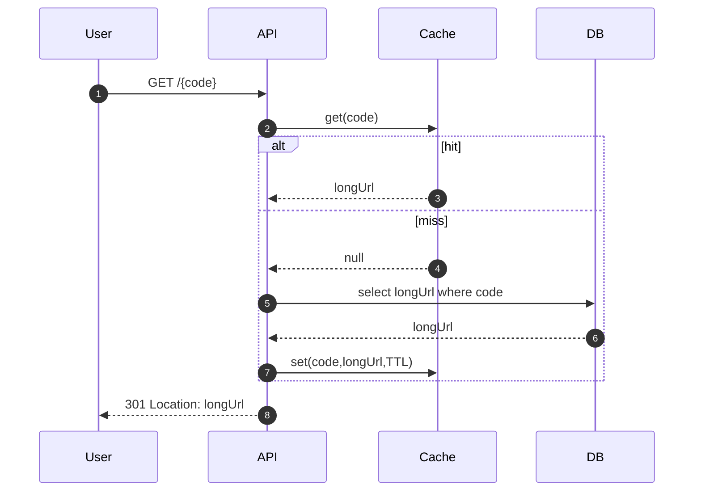

## Goal

Design a complete URL shortening service end-to-end, applying foundations and building blocks from previous lessons.

## Core concepts

- Requirements:
  - Create short URL for a long URL (optional custom alias)
  - Resolve short URL quickly with low latency
  - Basic analytics (click counts)
  - Abuse protection (rate limiting)
- API surface:
  - `POST /v1/urls` create
  - `GET /:code` resolve (redirect)
  - `GET /v1/urls/:code/stats` stats
- Data model:
  - `Url { code PK, longUrl, createdAt, expiresAt?, ownerUserId? }`
  - `UrlClick { id, code, ts, referrer?, country? }` (optional sampling)
- Caching: cache `code -> longUrl` on resolve path.

## Trade-offs

- **Code generation**: random vs sequential vs hash; random avoids enumeration but needs collision handling.
- **Redirect type**: 301 caches aggressively; 302 is safer if URLs can change.
- **Analytics detail**: per-click logs are expensive; aggregate counters are cheaper.

## Failure modes

- **Hot keys**: popular codes hammer cache/DB; ensure cache can handle hotspots.
- **Collision bugs**: code generation collisions; retry with uniqueness constraint.
- **Abuse**: spam creation or phishing; rate limit and add moderation hooks.
- **Cache stampede** on misses; coalesce requests or short TTL jitter.

## Interview prompts

1. How do you generate short codes and handle collisions?
2. What do you cache, where, and with what TTL?
3. How do you store analytics without blowing up storage?

## Mini design drill (10-15 min)

Design “create short URL” end-to-end:

- Request/response contract
- Code generation approach
- DB schema + unique constraint
- Rate limit policy

## Checkpoint quiz

1. Why might you choose 302 over 301 for redirects?
2. What’s a simple collision-handling strategy?
3. What is one way to do cheaper analytics than per-click logs?
