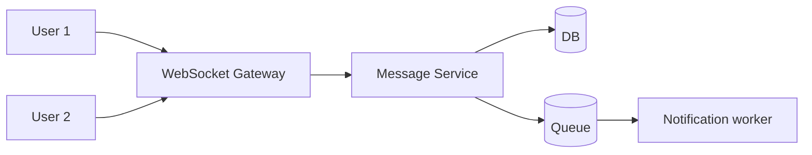

## Goal

Design a real-time chat system supporting 1:1 and group messaging, online presence, and message history.

## Core concepts

- Requirements:
  - Send/receive messages (1:1 and group)
  - Message history (pagination)
  - Online presence + typing indicators (best-effort)
  - Delivery/read receipts (optional)
- Core components:
  - WebSocket gateway for real-time fanout
  - Message service for persistence
  - Storage model partitioned by conversation
- Data model (sketch):
  - `Conversation { id, type, createdAt }`
  - `ConversationMember { conversationId, userId, role }`
  - `Message { conversationId, messageId/time, senderId, body, createdAt }`
- Ordering: per-conversation ordering; avoid global ordering.

## Trade-offs

- **WebSocket vs polling**: WS enables low latency; increases state and infra complexity.
- **Fanout on write vs fanout on read**: push to per-user inbox for fast reads, or compute on read for simpler writes.
- **Presence accuracy**: real-time presence is best-effort; design for occasional wrong state.

## Failure modes

- **Message duplication**: retries cause duplicates; use client message IDs + idempotent writes.
- **Out-of-order delivery**: network/WS reconnect; use per-conversation sequence numbers.
- **Backlog delivery**: offline users catch up; paginate and use push notifications for re-engagement.
- **Hot group chats**: large fanout; shard channels, degrade typing indicators first.

## Interview prompts

1. How do you store messages to fetch “latest 50” efficiently?
2. How do you handle reconnect and missed messages?
3. What’s your strategy for large group fanout?

## Mini design drill (10-15 min)

Design the “send message” path:

- API/WS event schema (include idempotency key)
- Write path to DB
- Fanout to online recipients
- Receipt semantics (delivered vs read) at a high level

## Checkpoint quiz

1. Why do chat systems often partition by conversation ID?
2. What’s an idempotency key and where does it help here?
3. Name one feature you can degrade to protect core messaging.
