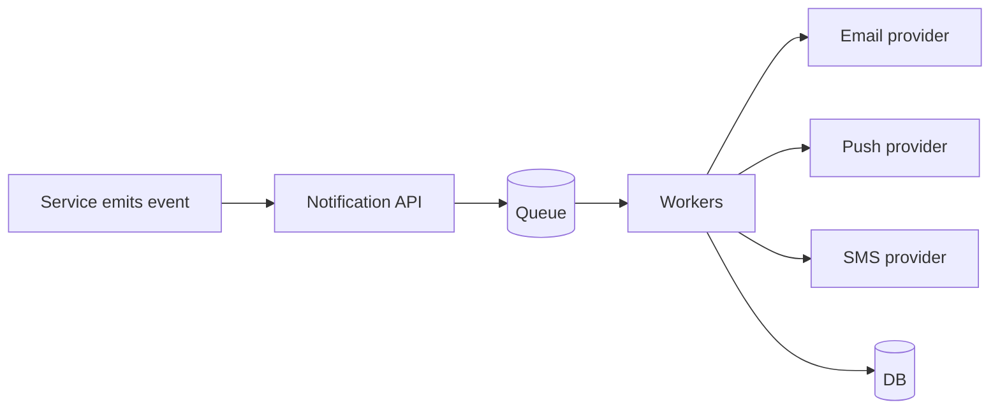

## Goal

Design a multi-channel notification system supporting push, SMS, and email with deduplication, rate limiting, and user preferences.

## Core concepts

- Requirements:
  - Multi-channel delivery: email, SMS, push
  - User preferences (opt-in/out, quiet hours)
  - Deduplication (avoid sending same notification twice)
  - Rate limiting (per user, per template)
  - Retries + provider failover
- Architecture:
  - API receives “notify” requests
  - Enqueue to a durable queue
  - Workers render templates and send via providers
  - Store send attempts + final status for audit

## Trade-offs

- **Synchronous vs async**: async is reliable and scalable; sync is simpler but ties caller latency to provider latency.
- **Dedup strategy**: per-event idempotency key vs content-based hashing.
- **Provider abstraction**: common interface simplifies failover but can hide provider-specific features.

## Failure modes

- **Duplicate sends**: at-least-once queue delivery; require idempotency key + unique constraint.
- **Provider outages**: retry with backoff and fail over to secondary provider when applicable.
- **Preference bugs**: sending after opt-out; keep preferences in a strongly-consistent store for compliance.
- **Backlog growth**: incidents or spikes; autoscale workers and shed non-critical notifications.

## Interview prompts

1. How do you dedupe notifications across retries and multiple producers?
2. How do you model user preferences and quiet hours?
3. What metrics do you monitor (queue age, send rate, provider errors)?

## Mini design drill (10-15 min)

Design “send password reset email”:

- Define request shape and idempotency key
- Enqueue message schema
- Worker steps (render, send, record)
- Retry and DLQ policy

## Checkpoint quiz

1. Why do notification systems commonly use queues?
2. What’s a practical dedup mechanism?
3. Name one failure that leads to duplicate sends.
