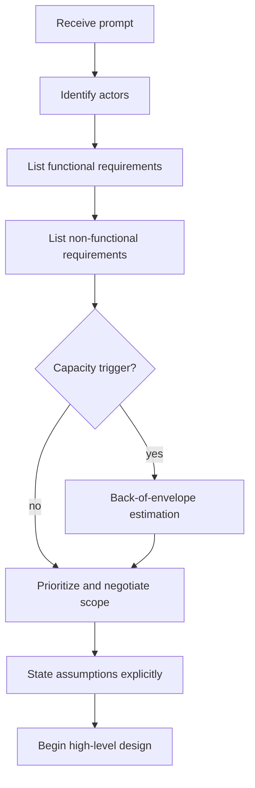

## Goal

Learn to decompose a vague systems design prompt into a precise set of functional and non-functional requirements, negotiate scope with the interviewer, and identify when a capacity estimation is needed before diving into architecture.

## Core concepts

- **Functional requirements (FRs)** describe *what* the system does from the user's perspective. For a URL shortener these would be "create a short link," "redirect to the original URL," and "optionally track click analytics." Always phrase FRs as user-facing actions because that is what the interviewer is listening for.

- **Non-functional requirements (NFRs)** describe *how well* the system performs. The most common NFRs in interview settings are latency (p99 redirect under 50 ms), availability (99.99 % uptime), durability (no link is ever lost), and consistency (a newly created link must be resolvable within N seconds). You do not need to enumerate every NFR -- pick the two or three that most constrain the design.

- **Scope negotiation** is the act of explicitly telling the interviewer what you will and will not cover. A good pattern is: "I will focus on the write path and read path for the core use case. I will defer the analytics pipeline unless we have time." This shows maturity. Interviewers reward candidates who set boundaries rather than boiling the ocean.

- **Actors and use cases** -- before listing requirements, spend 30 seconds identifying who interacts with the system. A ride-sharing system has riders, drivers, and an internal operations team. Each actor implies a different set of FRs.

- **Capacity estimation triggers** -- some NFRs (like "support 10 k writes per second") immediately imply you need a back-of-the-envelope calculation. Recognizing this trigger early lets you transition naturally into estimation rather than being prompted by the interviewer.

- **Read-to-write ratio** -- stating this ratio early shapes every downstream decision (caching strategy, replication topology, queue depth). For a social feed the ratio might be 100:1; for a logging pipeline it might be 1:100.

- **Versioning the requirements** -- as the interview progresses the interviewer may add or change requirements ("now assume we need multi-region support"). Treat requirements as a living document and revisit trade-offs when the constraints change.

## Requirements gathering flow

## Trade-offs

| Dimension | Narrow scope | Wide scope |
|-----------|-------------|------------|
| **Latency** | Easier to optimize a single path | Must balance latency across many paths |
| **Cost** | Fewer components to provision | More services, more infra spend |
| **Consistency** | Simpler consistency model | Cross-feature consistency is hard |
| **Complexity** | Lower operational burden | Higher cognitive load for the interviewer and you |

The key trade-off at the requirements stage is *depth vs breadth*. A narrow scope lets you show depth in architecture, data modeling, and failure handling. A wide scope risks producing a superficial diagram with no substance. In a 35-45 minute interview, prefer depth.

## Failure modes

1. **Skipping requirements entirely** -- jumping straight to "I'll use Kafka and Cassandra" without establishing what problem you are solving. This is the single most common reason candidates score poorly on systems design.

2. **Gold-plating** -- listing 15 non-functional requirements when only 3 matter. The interviewer will feel you are stalling.

3. **Assuming instead of asking** -- if the prompt says "design a chat system," do not assume end-to-end encryption is in scope. Ask. The interviewer might say "assume plaintext for now" and save you 10 minutes.

4. **Ignoring the read-to-write ratio** -- this ratio is the single highest-leverage number you can establish. Failing to state it means your caching and replication decisions will lack justification.

5. **Rigid scope** -- refusing to revisit requirements when the interviewer drops a new constraint mid-interview. Treat it as a feature, not an interruption.

## Interview prompts

1. "Walk me through how you would gather requirements for a system you have never built before."
2. "We have 30 minutes left. Which parts of this design would you cut, and why?"
3. "The product manager just told you the system also needs to support offline mode. How does that change your requirements?"
4. "What non-functional requirement would you relax first if you had to ship in two weeks?"
5. "How do you decide whether a feature belongs in v1 or v2?"

## Mini design drill (10-15 min)

**Prompt:** Design the requirements document for a collaborative document editor (like Google Docs).

1. Spend 2 minutes listing actors (end-user, admin, anonymous viewer).
2. Write 5 functional requirements (create doc, edit in real-time, share via link, comment, version history).
3. Write 3 non-functional requirements (p99 keystroke-to-render latency under 100 ms, 99.9 % availability, eventual consistency across collaborators within 500 ms).
4. State your read-to-write ratio assumption (roughly 5:1 -- most keystrokes are writes but each write fans out to N readers).
5. Decide what you would defer: spell-check, image embedding, offline mode.

Compare your list with a partner or write it on paper and revisit it after completing the estimation lesson.

## Checkpoint quiz

1. **What is the difference between a functional and a non-functional requirement? Give one example of each for a ride-sharing app.**
   *FR: "A rider can request a ride from location A to location B." NFR: "Match a rider to a driver within 30 seconds at p99."*

2. **Why is stating the read-to-write ratio valuable early in a systems design interview?**
   *It shapes caching strategy, replication topology, and queue sizing. A read-heavy system benefits from aggressive caching; a write-heavy system benefits from append-optimized storage.*

3. **Name two risks of skipping the requirements phase.**
   *You may design for the wrong problem, and you lose the chance to show the interviewer your communication and prioritization skills.*

4. **When should you trigger a back-of-envelope estimation during the requirements phase?**
   *When a non-functional requirement implies a specific throughput, storage, or bandwidth target -- for example "support 100 k concurrent users."*

5. **An interviewer adds a new constraint halfway through your design. What should you do?**
   *Acknowledge the constraint, revisit the affected requirements, state which parts of the design need to change, and proceed. Do not start over from scratch.*
