## Goal

Develop the ability to produce quick, defensible estimates for QPS, storage, bandwidth, and memory so you can justify architectural decisions during a systems design interview.

## Core concepts

- **Queries per second (QPS)** -- the most basic throughput number. Start from daily active users (DAU), multiply by the average number of actions per user per day, then divide by 86 400 (seconds in a day). Peak QPS is typically 2-5x the average depending on the product.

- **Storage estimation** -- figure out how much data the system produces per day, then extrapolate to the design horizon (usually 5 years). Always state the unit size of a single record first, then multiply by volume.

- **Bandwidth estimation** -- multiply QPS by the average payload size to get bytes per second. Separate ingress (writes) from egress (reads) because they often differ by an order of magnitude in read-heavy systems.

- **Memory estimation for caching** -- apply the 80/20 rule: 20 % of the data serves 80 % of the reads. Estimate the size of the hot working set and check whether it fits in a single machine's RAM or requires a distributed cache.

- **Powers of two and latency reference numbers** -- memorize a small table of constants so you can compute on the fly without a calculator. Key values: 1 KB = 10^3 bytes, 1 MB = 10^6, 1 GB = 10^9, 1 TB = 10^12. Network round-trip within a data center is roughly 0.5 ms; SSD random read is roughly 0.1 ms; HDD seek is roughly 10 ms.

- **Sanity-checking** -- after every estimate, do a gut check. If your calculation says you need 500 TB of RAM, something is wrong. Compare against known systems: Twitter handles roughly 600 M tweets/day; Google serves roughly 8.5 B searches/day.

- **Stating assumptions** -- every number you produce rests on assumptions. Say them out loud: "I am assuming 300 M monthly active users with 40 % DAU." The interviewer may correct you, which is a good thing -- it means the conversation is collaborative.

## Estimation flow

```mermaid
flowchart LR
    A[Define user base] --> B[Compute DAU]
    B --> C[Actions per user per day]
    C --> D[Average QPS = DAU * actions / 86400]
    D --> E[Peak QPS = avg * peak factor]
    E --> F[Record size]
    F --> G[Daily storage = QPS * record size * 86400]
    G --> H[5-year storage]
    H --> I[Bandwidth = QPS * payload]
    I --> J[Cache size = hot set estimate]
    J --> K[Sanity check]
```

## Worked example: Twitter-scale tweet service

**Given assumptions:**
- 300 M monthly active users (MAU)
- 40 % are daily active: DAU = 120 M
- Each user views 50 tweets/day on average (read) and posts 2 tweets/day (write)
- Average tweet payload: 300 bytes of text + 200 bytes of metadata = 500 bytes
- 10 % of tweets include a media link adding 250 bytes of metadata (the media itself is stored in object storage)

### QPS

| Metric | Calculation | Result |
|--------|------------|--------|
| Write QPS (avg) | 120 M * 2 / 86 400 | ~2 800 writes/s |
| Write QPS (peak) | 2 800 * 3 | ~8 400 writes/s |
| Read QPS (avg) | 120 M * 50 / 86 400 | ~69 000 reads/s |
| Read QPS (peak) | 69 000 * 5 | ~345 000 reads/s |

The read-to-write ratio is roughly 25:1, which tells us caching will be critical.

### Storage (5-year horizon)

| Component | Calculation | Result |
|-----------|------------|--------|
| Tweets per day | 120 M * 2 | 240 M tweets |
| Text + meta per day | 240 M * 500 B | 120 GB/day |
| Media meta per day | 240 M * 0.10 * 250 B | 6 GB/day |
| Daily total | | ~126 GB/day |
| 5-year total | 126 GB * 365 * 5 | ~230 TB |

230 TB of structured data is large but well within the range of a sharded relational or wide-column store.

### Bandwidth

| Direction | Calculation | Result |
|-----------|------------|--------|
| Ingress (writes) | 8 400 * 500 B | ~4.2 MB/s peak |
| Egress (reads) | 345 000 * 500 B | ~172 MB/s peak |

172 MB/s of egress is roughly 1.4 Gbps -- a single modern NIC can handle this, but you would distribute it across many read replicas and a CDN.

### Cache sizing

If 20 % of tweets account for 80 % of reads, and we want to cache the last 24 hours of hot tweets:

- Tweets in 24 h: 240 M
- Hot set: 240 M * 0.20 = 48 M tweets
- Cache size: 48 M * 500 B = 24 GB

24 GB fits comfortably in a single Redis instance (or a small cluster for redundancy).

## Trade-offs

| Dimension | Conservative estimate | Aggressive estimate |
|-----------|----------------------|---------------------|
| **Cost** | Over-provision, higher infra bill | Under-provision, risk of outages |
| **Latency** | More headroom, lower tail latency | Saturation at peak, latency spikes |
| **Complexity** | May deploy more shards than needed | May need emergency re-sharding later |

In an interview, lean slightly conservative. It is easier to say "we can scale down later" than to explain why the system fell over on launch day.

## Failure modes

1. **Forgetting peak vs average** -- designing for average QPS means your system browns out during peak traffic. Always compute peak and design for it.

2. **Mixing units** -- accidentally using megabytes where you meant megabits, or confusing KB with KiB. State units explicitly every time.

3. **Ignoring metadata overhead** -- a tweet is not just 300 bytes of text. There are timestamps, user IDs, indexes, and replication overhead. A good rule of thumb is to add 30-50 % for metadata and encoding.

4. **Not sanity-checking** -- if your estimate says the system needs 1 PB of RAM, stop and re-examine your assumptions.

5. **Spending too long on estimation** -- this phase should take 3-5 minutes in an interview. Produce round numbers, state your assumptions, and move on.

## Interview prompts

1. "Estimate the storage needed for a YouTube-like service that ingests 500 hours of video per minute."
2. "How many machines would you need to serve 1 million WebSocket connections simultaneously?"
3. "If each API call returns 2 KB on average and we serve 50 k requests per second, what is our egress bandwidth?"
4. "Walk me through how you would estimate the cache hit ratio for a social media feed."
5. "Our system currently handles 10 k QPS. The PM says traffic will 10x in 6 months. What changes?"

## Mini design drill (10-15 min)

**Prompt:** Estimate the infrastructure for a ride-sharing matching service.

1. Assume 20 M DAU riders, 2 M active drivers at peak.
2. Each rider requests an average of 1.5 rides per day. Each request triggers a match query.
3. Match query payload: 200 bytes (rider location, preferences). Response: 500 bytes (driver info, ETA).
4. Compute average and peak QPS for match requests.
5. Estimate how much memory you need if you cache all active driver locations (driver ID 8 bytes + lat/lng 16 bytes + status 4 bytes = 28 bytes per driver).
6. Sanity-check: does your cache fit on one machine?

**Expected rough answers:**
- Avg match QPS: 20 M * 1.5 / 86 400 = ~347 QPS; peak = ~1 040 QPS.
- Driver cache: 2 M * 28 B = 56 MB -- trivially fits in one machine.

## Checkpoint quiz

1. **How do you convert DAU and actions-per-user into average QPS?**
   *Multiply DAU by actions per user per day, then divide by 86 400.*

2. **What is a reasonable peak-to-average multiplier for a consumer app?**
   *Typically 2x to 5x, depending on usage patterns. Social media with global events can spike higher.*

3. **In the Twitter example, why is the read-to-write ratio important for cache sizing?**
   *A 25:1 ratio means reads dominate. Caching even a small hot set dramatically reduces database load.*

4. **You estimate 230 TB of storage over 5 years. What kind of database would you consider?**
   *A horizontally sharded wide-column store (like Cassandra) or a sharded relational database. A single-node RDBMS cannot hold 230 TB.*

5. **Your bandwidth estimate comes out to 50 Gbps of egress. What should you immediately think about?**
   *A CDN for static/cacheable content, read replicas to spread load, and whether the estimate is correct -- 50 Gbps is very high and warrants a sanity check.*
