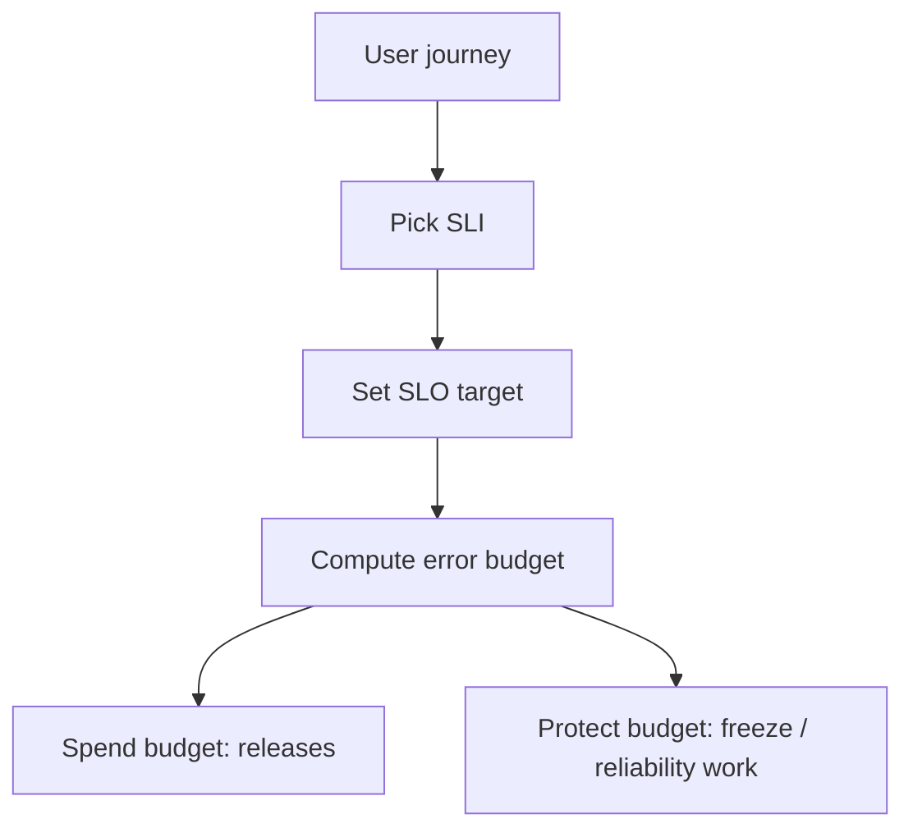

## Goal

Understand service-level objectives, service-level indicators, and how error budgets drive release and reliability decisions.

## Core concepts

- **SLI**: a measured signal (e.g., request success rate, latency p95, freshness).
- **SLO**: a target for an SLI over a window (e.g., 99.9% over 28 days).
- **SLA**: an external contract with consequences; usually looser than SLO.
- **Error budget**: \(1 - \text{SLO}\); the allowed “unreliability” to spend.
- Tie SLOs to user journeys (login, search, checkout), not internal components.

## Trade-offs

- **Ambitious SLOs** increase cost and slow delivery; too-loose SLOs harm trust.
- **Latency vs availability**: lowering timeouts can improve perceived latency but increase error rate.
- **Per-endpoint vs per-journey SLOs**: per-endpoint is actionable; per-journey reflects real UX.

## Failure modes

- **Vanity SLOs**: targets that don’t map to user pain (e.g., “CPU < 60%”).
- **Bad SLI definitions**: counting 500s only ignores partial failures and high latency.
- **No segmentation**: mixing regions/tenants hides localized outages.
- **Not enforcing budget policy**: error budget exists but doesn’t change behavior.

## Interview prompts

1. For a chat app, define 2 SLIs and SLOs that reflect user experience.
2. If you burn 80% of budget in a week, what do you do next?
3. How would you handle a “fast but sometimes wrong” cache in SLO terms?

## Mini design drill (10-15 min)

Choose a product: URL shortener / notification service / chat.

- Define 1 key user journey.
- Pick 1 availability SLI and 1 latency SLI for that journey.
- Set a concrete SLO (target + window).
- Define the action you take when budget is exhausted.

## Checkpoint quiz

1. What’s the difference between SLO and SLA?
2. What does an error budget represent in plain language?
3. Why is “p99 latency” often more important than “average latency”?
