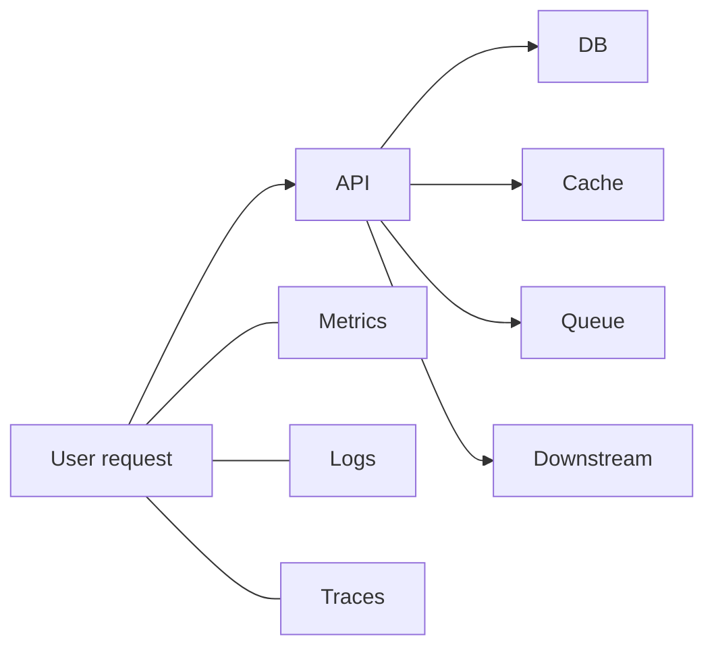

## Goal

Learn the three pillars of observability -- metrics, logs, and traces -- and how to reference them in a systems design interview.

## Core concepts

- **Metrics**: numeric time series for alerting and trend analysis (SLIs, saturation).
- **Logs**: discrete events for debugging and audit trails (structured preferred).
- **Traces**: end-to-end request flows across services (spans + context propagation).
- Use the “golden signals”: latency, traffic, errors, saturation.
- Instrument at boundaries: ingress, database, cache, queue, external dependencies.

## Trade-offs

- **Cardinality**: high-cardinality labels (userId, requestId) explode metric cost; keep them in logs/traces.
- **Sampling**: tracing everything is expensive; sample intelligently, keep error traces.
- **Retention**: long retention helps forensics; costs grow quickly.

## Failure modes

- **Alert storms**: too many alerts without routing/ownership; use SLO-based paging.
- **No correlation IDs**: can’t connect logs ↔ traces ↔ user reports.
- **Missing instrumentation on critical path**: you only notice after an incident.
- **Dashboard-only ops**: relying on graphs without actionable runbooks.

## Interview prompts

1. What would you alert on for a URL shortener’s “resolve short link” endpoint?
2. How would you debug intermittent p99 latency spikes?
3. Where do you put correlation IDs and how do they propagate?

## Mini design drill (10-15 min)

For “send chat message”:

- Define 3 metrics (one each for latency, errors, saturation).
- Define 2 structured log events (include key fields).
- Define 1 trace you’d want to see and the spans it should include.

## Checkpoint quiz

1. Why is high-cardinality dangerous for metrics?
2. What’s the difference between logs and traces?
3. Name the four golden signals.
