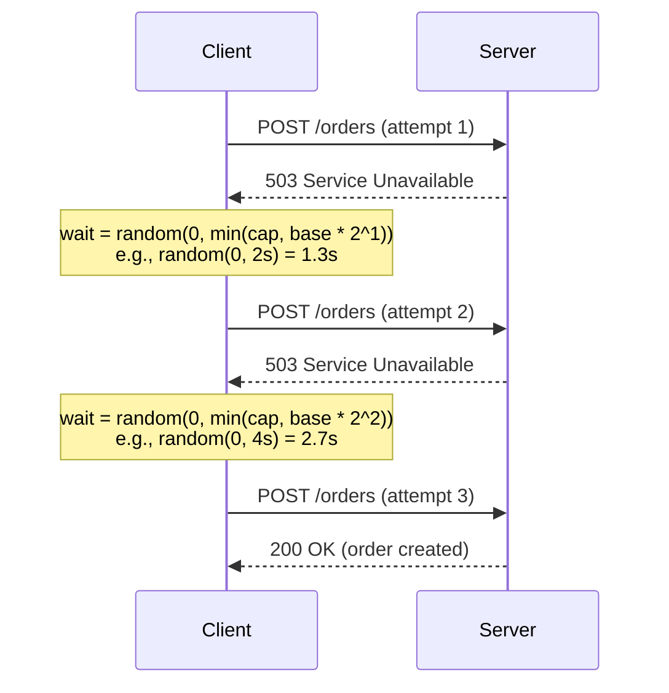
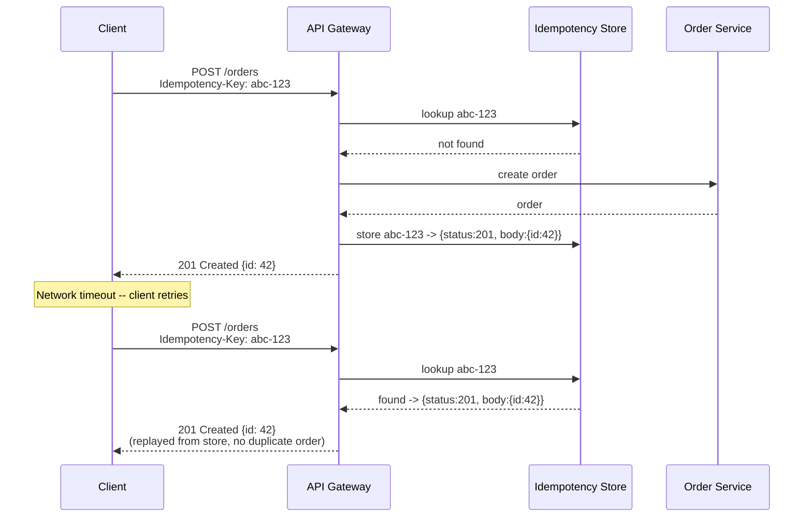
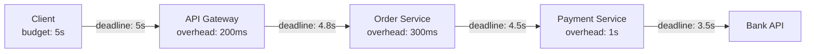

## Goal

Understand how to build resilient distributed communication using retries with exponential backoff and jitter, timeout budgets that prevent cascade failures, and idempotency keys that make retries safe. These three mechanisms work together and should be designed as a unit.

## Core concepts

- **Retries with exponential backoff** -- when a request fails due to a transient error (network blip, server overload, temporary unavailability), the client waits and tries again. Exponential backoff means each successive wait doubles: 1 s, 2 s, 4 s, 8 s, and so on up to a cap. This prevents a thundering herd of retries from overwhelming the server that is already struggling.

- **Jitter** -- if a thousand clients all start their retry timers at the same instant, exponential backoff alone still produces synchronized bursts at 1 s, 2 s, 4 s, etc. Adding a random component ("jitter") to each wait interval spreads retries across time. Full jitter picks a random value between 0 and the current backoff ceiling. Equal jitter picks a value between half the ceiling and the full ceiling. Full jitter generally produces the best load distribution.

- **Retry budgets** -- instead of allowing unlimited retries per request, set a budget: "retry at most 3 times" or "spend at most 10 % of total requests on retries." A budget prevents a failing downstream from causing an amplification cascade where each layer of the stack multiplies the retry count.

- **Timeout budgets** -- every outbound call should have a deadline. A timeout budget is the total time allocated for an end-to-end operation, subdivided across each hop. If the top-level budget is 3 seconds and the first hop takes 1 second, the second hop gets at most 2 seconds. Without timeout budgets, a slow downstream ties up threads and connections in the caller, eventually causing the caller to fail too (cascading failure).

- **Idempotency** -- an operation is idempotent if performing it multiple times produces the same result as performing it once. HTTP GET and DELETE are naturally idempotent. POST (create) and non-trivial updates are not. To make non-idempotent operations safe to retry, attach an **idempotency key** -- a unique token generated by the client and sent with every attempt. The server checks whether it has already processed that key; if so, it returns the stored result instead of executing the operation again.

- **Idempotency key storage** -- the server must persist the mapping from idempotency key to result. This can be a dedicated table (key, response, created_at, expires_at) or a column in the domain table. Keys should expire after a reasonable window (e.g., 24-48 hours) to limit storage growth.

- **Distinguishing transient from permanent errors** -- only retry on transient errors (HTTP 429, 502, 503, connection reset). Retrying a 400 Bad Request or 404 Not Found is pointless and wastes resources. A well-designed client classifies errors before deciding to retry.

## Retry flow with exponential backoff and jitter

## Idempotency key deduplication flow

## Timeout budget propagation

Each hop subtracts its own processing overhead from the remaining budget before forwarding the deadline. If any hop exceeds its remaining budget, it returns immediately with a timeout error rather than blocking upstream callers.

## Trade-offs

| Dimension | More retries / longer timeouts | Fewer retries / shorter timeouts |
|-----------|-------------------------------|----------------------------------|
| **Latency** | Tail latency increases because slow requests get multiple chances | Fail fast, lower p99 but more user-visible errors |
| **Cost** | More compute and bandwidth spent on retries | Lower cost but potentially lost revenue from failed requests |
| **Consistency** | Without idempotency, retries can cause duplicates | Safer but may drop legitimate requests |
| **Complexity** | Idempotency store adds a component to manage and expire | Simpler stack but less resilient |

The sweet spot for most systems: 2-3 retries with full jitter, a cap of 30-60 seconds, a global timeout budget propagated via request headers or context, and idempotency keys on all mutating endpoints.

## Failure modes

1. **Retry storms (amplification)** -- three layers of the stack each retry 3 times. A single failed request becomes 3^3 = 27 downstream calls. Solution: propagate a retry budget or use a token-bucket limiter on outbound retries.

2. **Missing jitter** -- all clients back off in lockstep, creating periodic load spikes that look like a heartbeat on your monitoring dashboard. The server never gets a quiet window to recover.

3. **No timeout on outbound calls** -- a client waits indefinitely for a response. The thread is blocked, the connection pool fills up, and the caller itself becomes unavailable. This is the most common cause of cascading failures in microservice architectures.

4. **Idempotency key reuse across different operations** -- if a client reuses the same key for two different orders, the second order silently returns the first order's result. Keys must be unique per logical operation (UUID v4 is the simplest approach).

5. **Idempotency store unavailability** -- if the store itself is down, the server must decide: reject all writes (safe but disruptive) or process without dedup (risky). A common middle ground is to use a short-lived in-memory cache as a fallback and alert on-call.

6. **Retrying non-transient errors** -- retrying a 400 Bad Request wastes resources and delays the real fix (the client sent malformed data). Classify errors into retryable and non-retryable categories at the client level.

## Interview prompts

1. "A payment service is occasionally returning 503. How would you design the retry logic in the calling service?"
2. "Two retries succeeded for the same charge request. How do you prevent the customer from being double-charged?"
3. "Your microservice call chain is five services deep. How do you prevent a slow leaf service from taking down the entire chain?"
4. "What is the difference between full jitter and equal jitter, and when would you prefer one over the other?"
5. "How long should you keep idempotency keys before expiring them? What are the trade-offs?"

## Mini design drill (10-15 min)

**Prompt:** Design the retry and idempotency layer for an e-commerce checkout service.

1. The checkout calls three downstream services sequentially: inventory reservation, payment processing, and order confirmation.
2. The end-to-end SLA is 8 seconds at p99.
3. Each downstream service can transiently fail with 503.

**Tasks:**
- Allocate a timeout budget across the three calls (e.g., 3 s + 3 s + 1.5 s + 0.5 s overhead).
- Define retry policy for each call: max attempts, backoff base, cap, jitter strategy.
- Decide which calls need idempotency keys. (Hint: payment definitely does. Inventory reservation is also important if it decrements stock.)
- Sketch what happens if the payment call succeeds but the order confirmation call fails. How do you avoid charging the customer without creating an order? (Answer: use a saga pattern or store the payment result and retry order confirmation with its own idempotency key.)

## Checkpoint quiz

1. **Why is exponential backoff alone insufficient? What does jitter add?**
   *Exponential backoff without jitter causes synchronized retry bursts. Jitter randomizes the wait time so retries spread across the interval, giving the server breathing room to recover.*

2. **A request has an idempotency key and the server crashes after processing but before storing the result. What happens on retry?**
   *The server has no record of the key, so it processes the request again, potentially causing a duplicate. To guard against this, wrap the operation and the idempotency-store write in the same transaction (or use write-ahead logging).*

3. **Your call chain is A -> B -> C. A sets a 5-second timeout. B takes 2 seconds. How much time should C get?**
   *At most 3 seconds minus B's overhead for forwarding the request. In practice, subtract a small buffer (e.g., 200 ms) for network latency, so C gets roughly 2.8 seconds.*

4. **Should you retry an HTTP 400 response? Why or why not?**
   *No. A 400 indicates a client error (bad input). Retrying will produce the same result. Only retry transient server errors like 429, 502, 503, or connection timeouts.*

5. **What is a retry budget and why does it matter in a multi-layer architecture?**
   *A retry budget caps the fraction of total traffic that can be retries (e.g., 10 %). Without it, each layer multiplies retries, causing exponential amplification that can take down the entire system.*
