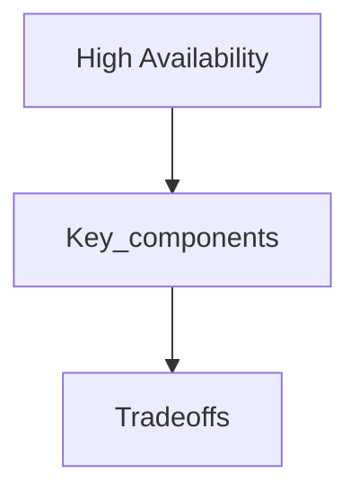

## Goal

Learn high availability using a vetted, open-licensed reference and apply it in interview-style design discussions.

## Core concepts

# HA - Availability - Common “Nines”
Availability is generally expressed as “Nines”, common ‘Nines’  are listed below.

| Availability %                  | Downtime per year |  Downtime per month | Downtime per week | Downtime per day |
|---------------------------------|:-----------------:|:-------------------:|:-----------------:|:----------------:|
| 99% (Two Nines)                  |  3.65 days        |    7.31 hours       |  1.68 hours       |  14.40 minutes   | 
| 99.5% (Two and a half Nines)     |  1.83 days        |    3.65 hours       | 50.40 minutes     |   7.20 minutes   |
| 99.9% (Three Nines)              |  8.77 hours       |   43.83 minutes     | 10.08 minutes     |   1.44 minutes   |
| 99.95% (Three and a half Nines)  |  4.38 hours       |   21.92 minutes     |  5.04 minutes     |  43.20 seconds   |
| 99.99% (Four Nines)              | 52.60 minutes     |    4.38 minutes     |  1.01 minutes     |   8.64 seconds   |
| 99.995% (Four and a half Nines)  | 26.30 minutes     |    2.19 minutes     | 30.24 seconds     |   4.32 seconds   |
| 99.999% (Five Nines)             |  5.26 minutes     |   26.30 seconds     |  6.05 seconds     |  864.0 ms        |

### Refer
- [https://en.wikipedia.org/wiki/High_availability#Percentage_calculation](https://en.wikipedia.org/wiki/High_availability#Percentage_calculation)

## HA - Availability Serial Components

A System with components is operating in the series if the failure of a part leads to the combination becoming inoperable.

For example, if LB in our architecture fails, all access to app tiers will fail. LB and app tiers are connected serially.

The combined availability of the system is the product of individual components availability:

*A = Ax x Ay x …..*

### Refer
- [http://www.eventhelix.com/RealtimeMantra/FaultHandling/system_reliability_availability.htm](http://www.eventhelix.com/RealtimeMantra/FaultHandling/system_reliability_availability.htm)

## HA - Availability Parallel Components

A System with components is operating in parallel if the failure of a part leads to the other part taking over the operations of the failed part.

If we have more than one LB and if the rest of the LBs can take over the traffic during one LB failure, then LBs are operating in parallel.

The combined availability of the system is

*A = 1 - ( (1-Ax) x (1-Ax) x ….. )*

### Refer
- [http://www.eventhelix.com/RealtimeMantra/FaultHandling/system_reliability_availability.htm](http://www.eventhelix.com/RealtimeMantra/FaultHandling/system_reliability_availability.htm)

## HA - Core Principles

**Elimination of single points of failure (SPOF)** This means adding redundancy to the system so that the failure of a component does not mean failure of the entire system.

**Reliable crossover** In redundant systems, the crossover point itself tends to become a single point of failure. Reliable systems must provide for reliable crossover.

**Detection of failures as they occur** If the two principles above are observed, then a user may never see a failure. 

### Refer
- [https://en.wikipedia.org/wiki/High_availability#Principles](https://en.wikipedia.org/wiki/High_availability#Principles)

## HA - SPOF

**WHAT:** Never implement and always eliminate single points of failure.

**WHEN TO USE:** During architecture reviews and new designs.

**HOW TO USE:** Identify single instances on architectural diagrams. Strive for active/active configurations. At the very least, we should have a standby to take control when active instances fail.

**WHY:** Maximize availability through multiple instances.

**KEY TAKEAWAYS:** Strive for active/active rather than active/passive solutions. Use load balancers to balance traffic across instances of a service. Use control services with active/passive instances for patterns that require singletons.

## HA - Reliable Crossover

**WHAT:** Ensure when system components failover they do so reliably.

**WHEN TO USE:** During architecture reviews, failure modeling, and designs.

**HOW TO USE:** Identify how available a system is during the crossover and ensure it is within acceptable limits. 

**WHY:** Maximize availability and ensure data handling semantics are preserved.  

**KEY TAKEAWAYS:** Strive for active/active rather than active/passive solutions, they have a lesser risk of cross over being unreliable. Use LB and the right load-balancing methods to ensure reliable failover. Model and build your data systems to ensure data is correctly handled when crossover happens. Generally, DB systems follow active/passive semantics for writes. Masters accept writes and when the master goes down, the follower is promoted to master (active from being passive) to accept writes. We have to be careful here that the cutover never introduces more than one master. This problem is called a split brain.

## Applications in SRE role

1. SRE works on deciding an acceptable SLA and make sure the system is available to achieve the SLA
2. SRE is involved in architecture design right from building the data center to make sure the site is not affected by a network switch, hardware, power, or software failures
3. SRE also run mock drills of failures to see how the system behaves in uncharted territory and comes up with a plan to improve availability if there are misses. 
[https://engineering.linkedin.com/blog/2017/11/resilience-engineering-at-linkedin-with-project-waterbear](https://engineering.linkedin.com/blog/2017/11/resilience-engineering-at-linkedin-with-project-waterbear)

Post our understanding about HA, our architecture diagram looks something like this below:

## Trade-offs

- Latency: Identify where you add hops (cache, LB, queues) and how it shifts p95/p99.
- Cost: Call out which components scale linearly vs super-linearly with traffic.
- Consistency: State which data must be strongly consistent vs can be eventual.
- Complexity: Note operational overhead (deployments, oncall, observability).

## Failure modes

- Single points of failure and missing failover paths.
- Retry storms, overload collapse, and cache stampedes.
- Hot partitions / uneven traffic distribution and its impact on SLOs.

## Interview prompts

1. What are the top 2 constraints that drive this design choice?
2. What breaks first at 10× traffic, and how do you know?
3. What would you simplify for v1 and why?

## Mini design drill (10-15 min)

- Pick a product you use daily and identify where this concept appears in its architecture.
- Write 3 concrete SLOs and name the metrics you would monitor.

## Checkpoint quiz

1. What problem does this concept solve?
2. What is the main trade-off it introduces?
3. Name one common failure mode and one mitigation.
4. Where would you apply it in a URL shortener or chat system?
5. What metric would tell you it is working?
